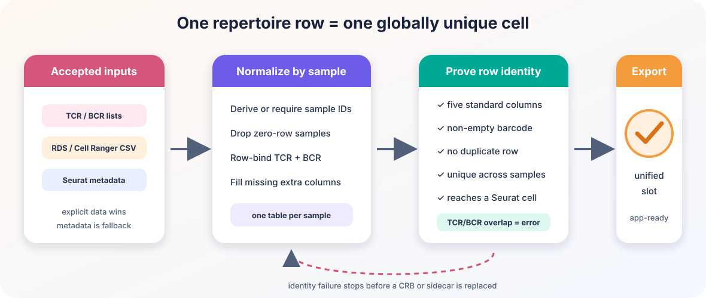

# Data integrity from Seurat to a self-contained Cerebro app

## Why this guide exists

A Cerebro app is the end of a chain:

``` text
Seurat assay -> complete expression matrix -> .crb (+ optional sidecar)
             -> self-contained app bundle -> interactive analyses
```

Each arrow changes representation. A plausible name is not enough to
prove that the correct data crossed the boundary:

- `data.sample_a` may be only one part of a Seurat v5 matrix;
- two repertoire rows with barcode `AAAC-1` may count one cell twice;
- a `.crb` and its sidecar may be left disagreeing by an error late in
  the export.

CerebroNexus therefore uses one rule throughout the chain:

> Resolve identity, validate completeness and uniqueness, stage the
> result, and only then begin replacing published files.

This overview explains how the three contracts fit together. Follow the
linked topic guides for commands and troubleshooting.

## Contract 1: one complete expression matrix

Seurat v5 can represent one logical layer as several physical layers:

``` text
RNA
├── data.donor_a
└── data.donor_b
```

CerebroNexus does not choose a layer because its name merely starts with
`data`. It proves that candidate cell memberships form one unique,
disjoint partition of all assay cells and then joins that partition on a
local object.

An unrelated custom matrix such as `data.imputed` is protected from
[`JoinLayers()`](https://satijalab.github.io/seurat-object/reference/SplitLayers.html).
A deeper complete split such as `data.imputed.donor_a/donor_b`,
requested as `data`, is semantically ambiguous and stops with an
explanation instead of silently becoming normalized data.

Every operation that describes the complete object applies the same
final check:

``` text
unique matrix cells == unique Seurat object cells
```

If the sets match but order differs, CerebroNexus reorders the matrix
once. Missing or unexpected cells are an error.

For the complete algorithm, diagrams, performance limits, and
troubleshooting, see [Seurat v5 layered
assays](https://mihem.github.io/CerebroNexus/articles/seurat_v5_layered_assays.md).

## Contract 2: one repertoire row per cell

The immune-repertoire module treats a row as one cell carrying one
clonotype. That only works if barcode identity is unique.



The canonical structure is:

``` r
repertoire <- list(
  donorA = data.frame(
    barcode = c("donorA_AAAC-1", "donorA_TTGC-1"),
    CTgene = c("TRAV1.TRAJ1", "IGHV1.IGHJ1"),
    CTnt = c("TGT...", "TGC..."),
    CTaa = c("CAV...", "CAR..."),
    CTstrict = c("TRAV1;CAV...", "IGHV1;CAR...")
  )
)
```

The contract requires:

- one named data frame per sample;
- all five standard identity/clone-call columns;
- a non-empty barcode in every row;
- no duplicate barcode in a sample;
- no barcode reused by another sample;
- no cell present in both TCR and BCR inputs.

TCR and BCR tables for the same sample are row-bound only after the
overlap check. Zero-row sample tables are treated as absence.

### Barcode overlap with the Seurat object

No overlap is an error: the app could not attach any receptor to any
cell. A common cause is `combineTCR(samples = ...)` adding sample
prefixes while the Seurat cell names were not changed with
[`RenameCells()`](https://satijalab.github.io/seurat-object/reference/RenameCells.html).

One whole sample failing to match while others do is a warning. Partial
overlap within a matching sample is ordinary after cells have been
filtered.

### Unified and legacy data

A valid `@misc$immune_repertoire` is authoritative. Stale legacy
`tcr_data`/`bcr_data` does not block it.

When only legacy slots exist, new exports validate and merge them into
the unified field while retaining the originals. Existing CRBs need
re-exporting because R6 methods are serialized into the file.

See [Immune repertoire
analysis](https://mihem.github.io/CerebroNexus/articles/immune_repertoire_analysis.md)
for Cell Ranger inputs, metadata extraction, scRepertoire integration,
and module use.

## Contract 3: stage CRB and sidecar replacement

An export can produce:

``` text
embedded -> dataset.crb
h5       -> dataset.crb + dataset.h5
bpcells  -> dataset.crb + dataset.bpcells/
```

Both artifacts are written in a private sibling stage. Later validation
of repertoire, HLA, markers, projections, and spatial data happens
before publication.

For BPCells, the matrix is reopened at its final location immediately
before the CRB is serialized, so the persisted handle points at the
published directory. If publication fails, newly installed files are
removed and the previous CRB/sidecar pair is restored on a best-effort
basis.

This is not an atomic transaction across two paths. It does not protect
against process termination or concurrent writers, and a failed
restoration is reported rather than hidden.

External modes require a `.crb` filename. This guarantees that the CRB
and its generated H5/BPCells sidecar have distinct portable paths on
every filesystem.

## What errors versus warnings mean

Errors mean that continuing would reinterpret identity or publish an
unusable artifact:

- ambiguous/incomplete expression partition;
- matrix/object cell mismatch;
- target-path collision;
- missing or escaping bundle input;
- malformed or duplicate repertoire identity;
- zero repertoire/cell overlap.

Warnings mean that the result remains interpretable:

- an explicitly allowed expression fallback, such as `data` to `counts`;
- one repertoire sample has no matching cells while another sample does;
- publication succeeded but an old backup could not be removed.

## Recommended workflow

1.  Keep source Seurat layers in memory for export, or materialize every
    intended split layer first.
2.  Export to a `.crb` path and choose `embedded`, `h5`, or `bpcells`.
3.  Add repertoire data through
    [`addImmuneRepertoire()`](https://mihem.github.io/CerebroNexus/reference/addImmuneRepertoire.md)
    rather than assigning an unchecked shape.
4.  Keep each external matrix beside its CRB under the serialized
    backend name.
5.  Build the app with
    [`createShinyApp()`](https://mihem.github.io/CerebroNexus/reference/createShinyApp.md)
    and treat any error it raises as a request to fix identity, not as a
    file-copy inconvenience.
6.  Move or deploy the resulting app directory as one unit.

## Further reading

- [Seurat v5 layered
  assays](https://mihem.github.io/CerebroNexus/articles/seurat_v5_layered_assays.md)
- [Create a self-contained Shiny
  app](https://mihem.github.io/CerebroNexus/articles/create_a_self_contained_shiny_app.md)
- [Immune repertoire
  analysis](https://mihem.github.io/CerebroNexus/articles/immune_repertoire_analysis.md)
- [Create an H5 expression
  matrix](https://mihem.github.io/CerebroNexus/articles/create_expression_matrix_in_h5_format.md)
