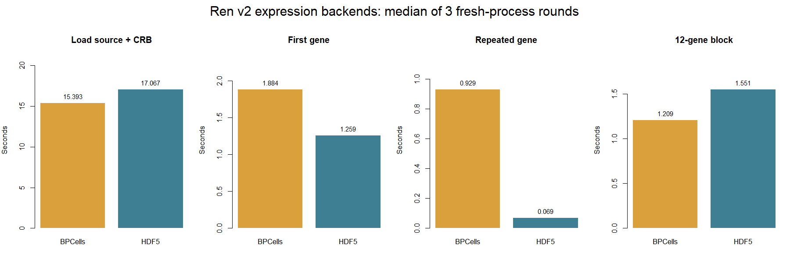

# PR6 maintainer acceptance — 2026-10-08

Functional source revision: `7cc203ee` on `perf/pr6-ui-accessibility-polish`.
These are local commits and local acceptance results; they have not been posted
to the maintainer or deployed into his running service.

## Status

| Concern | Result | Evidence / remaining boundary |
| --- | --- | --- |
| Broken large-data entry | Fixed locally | `run-demo.R --ren-only --prepare-only` completed for Ren v2; 1,462,702 cells. The launcher loads the checkout, reports the data version, and keeps versioned caches separate. Commit `37cbd1f4`. |
| Docker dependencies and authentication permissions | Fixed and container-tested | Local source installation; missing dependencies and declared minimum versions checked in a fresh R process. `qs2` 0.3.1, BPCells 0.3.1, shinymanager 1.1.0. Runtime user `shiny`; authentication directory/database 700/600 with `shiny:shiny` ownership. Invalid login rejected, valid login accepted. Commit `da5b63b2`. |
| Anna-Lena Projection/Spatial loading indefinitely | Not established | Projection and Spatial pass locally/in Docker, but her failing data, exact image/revision and logs are still unavailable. No claim that a frontend race caused her deployment failure. |
| cloneSharing and SizeDist | Passed on current Ren v2 | Real browser: both Plotly outputs rendered, then Projection rendered all 1,462,702 cells. Browser/server logs had no errors. This is functional acceptance, not a latency benchmark. |
| Spatial multiple samples | Concrete defect fixed; fixture acceptance passed | Missing coordinates were converted by `Number(null)` into zero coordinates. Commit `7cc203ee` preserves missing values. A two-section fixture split from Visium now draws 1,000 / 1,696 / 1,000 valid points when switching A→B→A, while retaining the 2,696-cell canonical index. The original failing user dataset remains untested. |
| Linked hover lag / disable control | Fixed and browser-tested | “Show cell hover” control; off by default at 200,000+ cells. Ren: enable gives a tooltip; disable retains box selection. Ren→1,476-cell dataset restores the small-data default. Commit `87f9625d`. |
| Gene regression against mihem's old version | Earlier controlled comparison found no first-visit regression | The five-round, same-data PR4/PR5 browser benchmark measured Gene Expression first visit at 3.061 s versus 3.025 s, and repeat visit at 0.614 s versus 0.009 s. This does not identify or reproduce mihem's separate ~7 s versus ~8 s Ren observation. |
| HDF5 versus BPCells | Measured; workload-dependent | Three interleaved fresh-process rounds; identical single-gene and 12-gene results. HDF5 is faster for single-gene access here; BPCells is faster for the materialized 12-gene block. See below. |
| Unified version / review communication | Local handoff prepared | Same checkout used for runtime and generated app, final container accepted. External push, official merge and maintainer notification have not been performed. |

## Deployment evidence

Follow [the deployment instructions](README.md). Generate authenticated apps
on a filesystem supporting private Unix modes (WSL `/home`, not `/mnt/c`).
The default `mihem/shinyapps_3838:v9.0` base needed both missing packages and a
shinymanager upgrade. Merely finding an installed namespace was insufficient.

Final tested images:

- Runtime: `cerebronexus-pr6-mihem-check:final`, image ID
  `sha256:d0384535f5433ee7ea816ca64d72e71633b7e3882eee514500895bd3954b03b4`.
- Generated authenticated example app: `cerebronexus-pr6-mihem-app:final`, image ID
  `sha256:da9c68164f887aaa6b4860ba24f11f9c68ca0ee8de46b4a7205f875f1ff20e8a`.

The app image is a local diagnostic fixture, not an image published for production.
Final container/browser sequence: invalid login → valid login → PBMC Projection
(1,476 cells) → Visium Spatial (2,696) → Xenium Spatial (5,000) → Visium Spatial
(2,696). No visible Shiny output errors or logged browser errors. Independent
test containers were removed afterwards; existing services were not modified.

## Repertoire/HDF5 boundary

Ren v2's lazy immune-repertoire sidecar is currently tied to the BPCells backend.
Changing only its expression descriptor to HDF5 is rejected. The expression
comparison therefore uses two diagnostic copies with repertoire removed
identically; all expression genes, cells, values and order are retained. The
original full Ren v2 data remains unchanged. This comparison does not establish
that an HDF5 app can replace the complete Ren v2 deployment without further work.

## Ren expression comparison

Reused the focused comparison from commit `2e86c98d`, restoring it as
`tests/bench/benchmark_ren_expression_backends.R`. Fixed the block measurement to
include `as.matrix()` inside the timed region: constructing a lazy block alone
does not measure data access.

WSL host R 4.6.1, 1,462,702 cells × 27,943 genes, three rounds in alternating
BPCells/HDF5 order, each in a fresh R process. No concurrent acceptance build or
browser test was running. OS caches were not flushed; these are warm-filesystem
diagnostics, not controlled cold-disk results and not Docker/page timings.

Seconds, P50 [minimum–maximum] across three rounds:

| Operation | BPCells | HDF5 |
| --- | --- | --- |
| Load source package + CRB | 15.393 [14.535–16.763] | 17.067 [16.229–20.615] |
| First single-gene query (`A1BG`) | 1.884 [1.874–2.062] | 1.259 [1.126–1.263] |
| Repeated single-gene query, per-round median | 0.929 [0.724–0.980] | 0.069 [0.069–0.109] |
| Materialized 12-gene block | 1.209 [0.768–1.243] | 1.551 [1.533–1.645] |

The fixed panel contains 12 genes spaced across the gene list; warm queries
repeat that panel three times per process. Every round passed single-gene and
12-gene value fingerprint checks over all cells. Raw rows are in
[the six-row TSV](../tests/bench/acceptance/ren-backends-20261008.tsv).
API timings include their indexing, naming/allocation and materialization work;
they are not isolated disk-I/O measurements.

Both formats are gene-major. The HDF5 diagnostic file was streamed from the
same BPCells values into cells × genes TENx format, double precision, gzip 6;
runtime reads use `HDF5Array::TENxMatrix`. This avoids trying to materialize the
entire matrix just to prepare a comparison. It is not an export-time comparison.

**Conclusion:** these results do not justify claiming BPCells is universally
faster, particularly for Gene's repeated single-gene workload. BPCells has an
observed batch-read advantage and currently supports Ren's lazy repertoire
sidecar. Keep it available, but use a controlled Gene-page HDF5/BPCells A/B and
profile the single-row API before deciding which backend should be preferred.
No backend was silently switched in the application. A historical Gene
regression claim still requires the matching old revision/environment.

The chart is generated from the checked TSV with
`Rscript tests/bench/plot_ren_backend_acceptance.R`.

## Earlier Gene Expression page comparison

The five-round PR4/PR5 browser comparison in
`tests/bench/VIEWER_1M_RESULTS.md` used the same one-million-cell CRB and
balanced fresh R/Chrome sessions. Median Gene Expression first visits were
3.061 s (PR4) and 3.025 s (PR5); repeat visits were 0.614 s and 0.009 s.
This supports no regression between those two revisions on that dataset. It
does not directly resolve the reported ~7 s to ~8 s Ren observation, because
the dataset and revision pair differ.

## Data preparation incident

The initial entry check encountered a legacy v1 cache. Its old preparation path
deleted the existing expression sidecar before regenerating it. That run was
interrupted, and the sidecar was rebuilt from the unchanged source H5AD. Dimensions,
all gene/cell names and exact values for all genes across 103 selected columns
were checked. The original CRB and v1 version marker were unchanged; byte-for-byte
identity of the old sidecar files was not measured. The committed versioned,
staged preparation now avoids this in-place replacement.

## Draft maintainer reply — not sent

The current PR6 checkout has a restored versioned Ren test entry and a Docker
recipe that builds this checkout. We tested encrypted login as the non-root
runtime user and exercised Projection and Spatial dataset switching in the
container. On Ren v2, cloneSharing and SizeDist render and the next Projection
page works. Linked hover now has an off switch and defaults off for large data.
We also fixed a multi-section Spatial defect that converted absent coordinates
to zero. We still need Anna-Lena's failing dataset/image/logs to close her loading
report, and the exact historical revision/environment to answer the Gene
regression question fairly. These local results are not a universal three-second
page-readiness claim.
