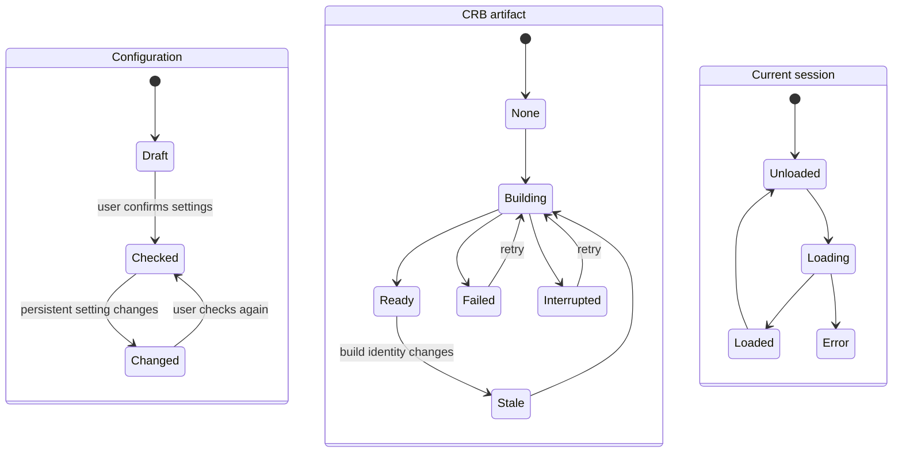
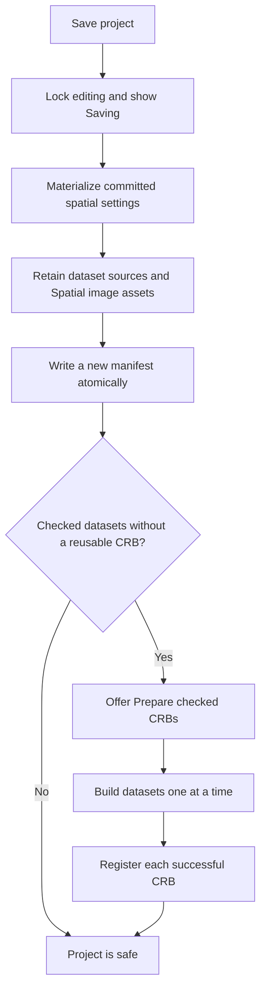
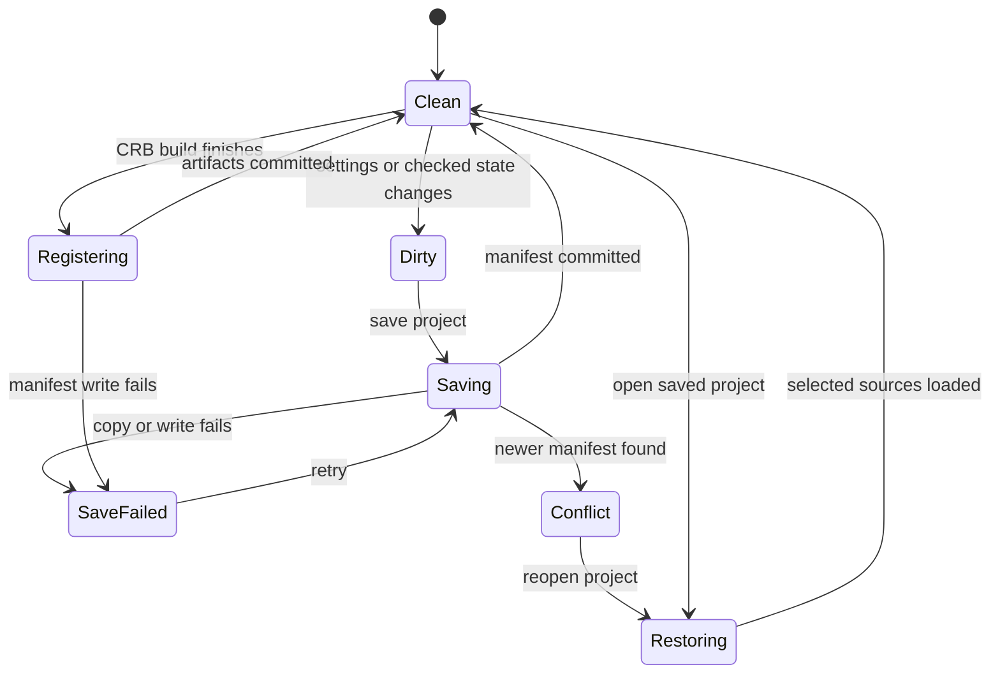
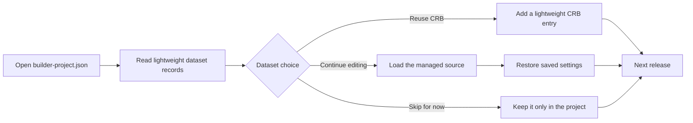
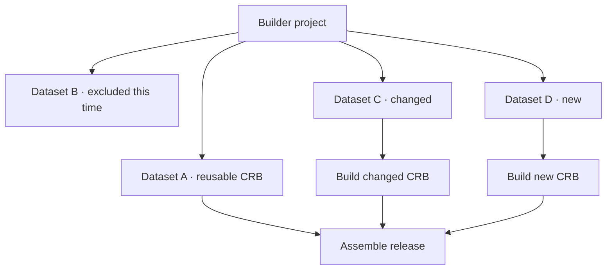

# Builder projects

CerebroNexus Builder can keep a multi-dataset build across sessions. A project
stores the source datasets, the choices made for each dataset, spatial image
settings, and CRB files that are safe to reuse.

The aim is simple: users should be able to stop after any dataset, return later,
and rebuild only the parts that changed.

## Project folder

The first successful upload offers to create a project folder. Browser uploads
are copied out of the Shiny session's temporary directory so they remain
available after the app closes.

```text
my-project/
├── builder-project.json
├── sources/
│   └── <dataset-id>/...
├── spatial-assets/
│   └── <dataset-id>/<fov>/...
├── artifacts/
│   └── <dataset-id>/...crb
└── checkpoints/
    └── <build-attempt>/...
```

`builder-project.json` is the working manifest. It records stable dataset IDs,
source locations, inspection summaries, user settings, checked state, and CRB
metadata. Managed paths are relative to the project folder. Authentication
secrets are not stored.

Spatial images are stored as verified project assets instead of large base64
strings inside the JSON manifest. Each image descriptor records its relative
path and fingerprint. Older manifests with inline image data are migrated on
their next save. Missing or changed image assets make the affected dataset
non-restorable instead of silently dropping its image.

## Independent states

A dataset does not have one linear status. Its configuration, source, runtime,
artifact, and release membership can change independently. For example, a
dataset can have a missing source but still have a valid CRB for publication.



`Checked` means that the user reviewed a configuration. `Ready` means that a CRB
was built from that configuration. A CRB is reusable only when its saved build
identity still matches the current dataset configuration and its files remain
available.

## Saving

Saving the project is deliberately separate from building CRBs. The manifest is
written before optional CRB preparation, so a long build cannot prevent the
user's work from being saved. Builder locks editing while it retains sources and
writes the manifest, and tells the user to keep the page open.



The manifest has a monotonic project revision. A save is rejected when another
Builder window has already written a newer revision. The previous manifest is
kept as `builder-project.json.bak` during replacement.

## Safe interaction

Builder derives every action from one activity state. The same capabilities
disable controls in the browser and reject stale requests on the server.



Uploads may continue while the user edits a different loaded dataset. Save,
Checked, Review, and Build wait until both browser and server import queues are
empty. Restoring blocks project mutations but keeps failed-import retry and
remove actions available. Saving and artifact registration make the workspace
temporarily inert.

Unsaved changes, imports, builds, restores, and project writes request a browser
warning before the page closes. A disconnected browser fails closed until the
server state is synchronized again.

## Opening a project

Opening a project starts with metadata only. The recovery dialog lets the user
decide how much data should enter memory.



A reusable CRB appears in the dataset rail without reopening its Seurat object.
The source can still be loaded later when the user wants to edit that dataset.
Loading the source restores the saved choices onto a fresh inspection of the
managed file. Coordinate and image controls enter the dataset configuration
automatically; there is no separate Spatial alignment save action.

Project checkpoint CRBs always receive a private embedded-image build
projection so every FOV image travels inside the reusable CRB. This projection
does not change the dataset's normal Viewer App storage preference.

## Incremental releases

The project is the complete workspace; a release is only a selected set of
datasets. Excluding a dataset from one release does not delete its settings or
CRB.



The normal build pipeline still verifies every reused CRB after copying it into
the private build stage. New or changed datasets continue through the existing
snapshot, analysis, export, and verification path.

## Practical constraints

- Managed uploads use additional disk space, but they are the reliable default
  for browser-based uploads whose original local path is unavailable.
- External spatial assets and expression sidecars must travel with their CRB;
  a missing companion file makes the artifact unavailable for reuse.
- A changed or re-linked source must be inspected again. It must not silently
  inherit a previous checked state.
- Closing the Shiny session can interrupt a running checkpoint build. Builder
  warns before closing, but cannot guarantee an automatic save after the browser
  or process has already terminated.
- Project JSON may contain local external paths, but generated Viewer packages
  must never expose them.
