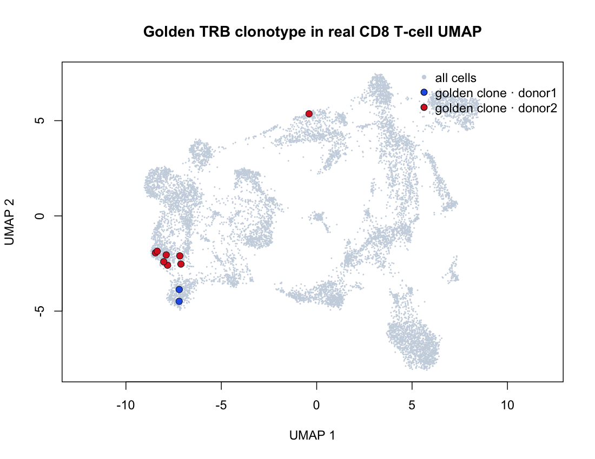

# HLA/TCR 端到端生物学主案例

## 一句话摘要

在真实、抗原筛选的 CD8 T-cell repertoire 中，固定 TRB clonotype
`TRBV19 / TRBJ1-5 / CASSIYSNQPQHF`。它包含 10 个细胞（donor1=2、donor2=8），并位于 `TRBV19::M13_1` 相近 CDR3 motif 家族中；该家族有 15 个 TRB 节点、30 个细胞，覆盖 donor1、donor2、donor3。



这是一条“真实数据 → motif 发现 → 稳定细胞选择 → Linked views 协作分享”的主线。标准答案保存在随包产物中，而不是保存在一条会过期的 URL 里：

- `inst/extdata/examples/demo_hla_tcr_dextramer.case.json`：全部冻结数字和科学边界；
- `inst/extdata/examples/demo_hla_tcr_dextramer.golden-clone.barcodes.tsv`：黄金细胞 barcode；
- `inst/extdata/examples/demo_hla_tcr_dextramer.linked-views.json`：Linked views v1 配置；
- `inst/extdata/examples/demo_hla_tcr_dextramer.sha256`：`.crb` 内容校验。

这里有一个必须写进案例的界面契约：Viewer 的 Clonal expansion 按 `CTgene`
定义 clone，而本案例冻结的是严格的 TRB `V/J/CDR3`。这 10 个细胞因一个
paired alpha gene call 不同而跨两个 `CTgene` calls；因此面板用于发现和定位，
barcode TSV 与 Linked views JSON 才是 10-cell 标准答案的权威选择入口。

## 固定的生物学结论

可以说：

1. 该 TRB clonotype 在 donor1 和 donor2 中扩增。
2. 它所在的相近 CDR3 motif family 跨 donor1、donor2、donor3 出现。
3. 这些细胞可以映射回真实 UMAP，并用 stable barcode 选择和分享。

不能说：

1. dextramer binder call 已经证明了肽段级抗原特异性；它是 10x 的 reagent binder call。
2. 这个 HLA 等位基因导致了这个 TCR。
3. 4 个供者足以支持统计学 HLA 关联推断。

黄金 clonotype 的 10 个细胞在当前对象中都带有 `Flu-MP_Influenza / GILGFVFTL / HLA-A*02:01` binder label，且 `restriction_in_genotype=yes`。这可以作为演示中的可见数据事实，但仍不能把 reagent label 改写成已验证的 antigen specificity。

## 演示路线

1. 打开 `demo_hla_tcr_dextramer.crb`，确认数据集是 antigen-selected real 10x dextramer cohort。
2. 进入 **Linked views**。
3. Projection 只保留 **UMAP**。
4. **Colour by** 选择 `sample`，先展示 donor 背景。
5. 在 **TCR / Clone**（或 Clonal expansion）面板中选择 TCR，定位 dominant `CASSIYSNQPQHF`，把它作为发现入口；不要用面板的 CTgene clone call 代替严格 TRB 标准答案。
6. 打开 Linked views 配置入口，导入 `demo_hla_tcr_dextramer.linked-views.json`（或按 `.golden-clone.barcodes.tsv` 复现选择），确认选中细胞为 10 个，donor1=2、donor2=8；查看它们在 UMAP 中的位置。
7. 将 Colour by 改成 `restriction_in_genotype`，说明 binder label 与 genotype status 是可视化证据，不是 specificity validation。
8. 进入 **HLA & TCR Motifs**，链选择 TRB，查看 `TRBV19::M13_1` 的 15 个节点、30 个细胞和三供者分布。
9. 返回 Linked views，打开配置入口，确认按钮是 **Share selection**，再生成分享链接。
10. 在无登录的新浏览器/隐私窗口打开链接，确认 Linked views、UMAP、sample colouring 和 10 个目标细胞恢复一致。

分享链接默认 90 天后过期。长期记录应保存本目录中的 JSON 与 barcode TSV；它们比 URL 更适合版本化和重新生成链接。

## 复现

仅校验已提交的 `.crb` 和案例产物：

```bash
Rscript data-raw/prepare_hla_tcr_end_to_end_case.R
Rscript -e 'testthat::test_file("tests/testthat/test-hla-tcr-end-to-end-case.R")'
```

从原始 10x 下载缓存重新构建 `.crb`（约 1.6 GB 缓存）再准备案例：

```bash
Rscript data-raw/build_hla_tcr_dextramer_demo.R
Rscript data-raw/prepare_hla_tcr_end_to_end_case.R
```

构建脚本本身负责来源、配对 α/β、donor balance、HLA typing、motif graph 和三态 genotype-status 的 gate；案例脚本只从已构建对象冻结主案例，避免把下载或随机 subsampling 混进演示过程。

## 验收清单

- [x] 真实 10x 单细胞数据，4 个真实 donor，配对 α/β TCR，真实 transcriptome 和发表的 HLA typing。
- [x] 黄金 clonotype 的 key、barcode、细胞数、donor 构成、alpha pairing、dextramer label、genotype status、UMAP 范围已冻结。
- [x] motif family 的节点数、细胞数、供者构成和 consensus 已冻结。
- [x] Linked views JSON 使用 cell fingerprint 和 barcode，不依赖鼠标坐标；polygon 仅作视图记录。
- [x] `.crb` SHA-256、构建命令和软件入口已记录。
- [x] 文档明确区分 binder call、genotype evidence 和 antigen specificity。
- [ ] 真实部署上的匿名分享链接需在每次发布前用新浏览器实际打开一次；链接本身不纳入长期标准答案，因为它会过期。
