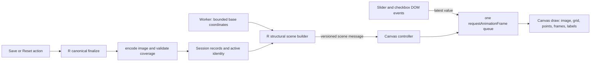

# Spatial Builder Canvas Live Preview Design

## Status

Approved for autonomous implementation on 2026-08-14.

This is a clean-room design based only on the current Builder behavior and
data contracts. It does not restore, copy, or adapt any historical Builder or
Viewer renderer. The runtime Spatial preview will no longer use Plotly.

## Goal

Replace the Spatial Builder preview with one purpose-built Canvas 2D renderer
that displays the tissue image, spatial points, coordinate frames, rotation
reference, grid, labels, and hover feedback in one coordinate system.

Every visual setting must update in the next browser animation frame while the
user drags or toggles it:

- coordinate rotation;
- image horizontal and vertical offset;
- image scale and rotation;
- image horizontal and vertical flip;
- image opacity;
- point opacity and size.

Dragging a control must not enqueue a worker request, encode an image, rebuild
server UI, or replace the preview DOM. Save remains the explicit durability
boundary.

## Non-goals

- Reuse or recovery of historical client-rendering code.
- Reuse of a Viewer renderer.
- A Plotly compatibility layer for the Spatial preview.
- Pan, zoom, selection, brush, lasso, or per-cell Shiny input events.
- Moving canonical image encoding or coverage validation into the browser.
- Changing the existing image and coordinate Save/Reset product semantics.
- Tests or validation in this implementation pass; those belong to a separate
  follow-up task.

## Considered approaches

### 1. Unified Canvas 2D renderer — selected

One canvas owns the image, points, frames, grid, labels, and hover geometry.
It uses no new browser dependency and is sufficient for the bounded preview of
at most 4,000 points. A single data-to-screen transform prevents drift between
layers.

### 2. Unified WebGL renderer

WebGL provides more point throughput but adds shader, text, image texture,
context-loss, accessibility, and test complexity that the bounded Builder
preview does not need.

### 3. Separate DOM image and SVG/Canvas point layers

This can make image transforms cheap, but it creates two layout and coordinate
systems that must remain synchronized through resize, DPR, and server redraws.
The extra boundary is unnecessary for this preview.

## Architecture



The client owns only transient presentation state. R remains authoritative for
dataset identity, saved coordinate transforms, image records, canonical
encoding, coverage diagnostics, build readiness, and export.

## Components

### Static UI surface

`builder_alignment_plot_output()` is replaced by a fixed preview wrapper with:

- one `<canvas>`;
- one DOM tooltip;
- one non-interactive status overlay;
- one visually hidden summary referenced by the canvas ARIA attributes.

The existing controls, layout, legend, FOV selector, image selector, and action
buttons retain their IDs and behavior.

### R scene builder

A new pure helper builds a JSON-safe scene containing:

- schema version and monotonically increasing generation;
- safe identity: dataset ID/revision, section ID/kind, and image label;
- sampled untransformed spatial `x`/`y`, barcode, and group index;
- group label, color, and sampled count;
- original coordinate frame and the saved coordinate rotation pivot;
- original image `source_uri` and immutable `base_bounds`;
- the authoritative control values used when a view is mounted or reset;
- availability, loading/error message, and capped-preview flag.

The payload must never include a Seurat object, worker object, snapshot path,
upload path, or rotated image generated for the current draft.

### Canvas controller

A new standalone JavaScript file owns the runtime renderer. Its public lifecycle
is conceptually:

```text
mount(canvas)
setScene(payload)
patchControls(values)
scheduleDraw(reason)
dispose()
```

It registers one Shiny custom-message handler for structural scenes and one
delegated control listener for the ten live inputs. A MutationObserver remounts
the current scene after the outer Shiny UI replaces the canvas.

The controller maintains one latest-value `requestAnimationFrame` queue. Many
input events before the next display frame collapse into one draw. It does not
add interpolation or a delayed CSS transition; the visible state follows the
current control value directly.

## Worker and coordinate data

The worker continues to produce the current authoritative preview used by R,
including full transformed bounds for fitting and Save behavior. It additionally
returns sampled base spatial coordinates before the saved coordinate transform
is applied.

The canvas always applies the absolute coordinate rotation control to those
base points. This avoids cumulative transforms and double rotation.

The pivot is the center of the full original coordinate bounds:

```text
px = (xmin + xmax) / 2
py = (ymin + ymax) / 2
```

For angle `theta` in radians:

```text
x' = px + (x - px) cos(theta) - (y - py) sin(theta)
y' = py + (x - px) sin(theta) + (y - py) cos(theta)
```

Positive angles remain counter-clockwise. Builder coordinate scale remains 1.

## Viewport and data-to-screen transform

The viewport freezes for the lifetime of one scene identity so moving or
rotating content cannot make the camera breathe.

It starts from the original coordinate-frame center and half-diagonal radius,
forming a square that contains every possible frame rotation. Initial image
base bounds are unioned once, then a small fixed padding is applied. Moving or
scaling an image outside that viewport clips naturally instead of moving the
camera.

For inner plot rectangle `left, top, width, height`, world center `cx, cy`, and
uniform scale `s`:

```text
s = min(width / worldWidth, height / worldHeight)
screenX = left + width / 2 + (x - cx) * s
screenY = top + height / 2 - (y - cy) * s
```

The Y inversion maps data-space Y-up to Canvas Y-down while preserving equal
axis scale.

## Image transform

The canvas decodes the unmodified `source_uri` once per image identity. It does
not draw the saved rotated PNG and then transform it again.

The original image size in data units is the immutable `base_bounds` span. Its
display center is the base center plus `dx` and `dy`; display width and height
are the base spans multiplied by `scale`.

Canvas operations are applied around the display center:

```text
translate to screen center
rotate by negative image degrees
scale by horizontal/vertical flip signs
draw source image centered at scaled width and height
```

The negative rotation compensates for Canvas Y-down so positive Builder image
rotation remains visually counter-clockwise.

## Draw order

Each frame draws:

1. surface background and clipped plot area;
2. nice grid and numeric ticks;
3. decoded tissue image with draft opacity and transform;
4. rotated points grouped by color;
5. original coordinate frame as a thin dotted line;
6. live transformed frame as a solid line;
7. the first transformed frame edge and endpoints in orange;
8. a signed one-decimal rotation label at that edge's midpoint.

The image is always below cells. The frames and rotation reference remain
visible above them.

## Resize and display density

Canvas layout uses CSS pixels. A ResizeObserver updates the backing store to
`cssSize * min(devicePixelRatio, 2)` and resets the context transform so point
sizes, line widths, and fonts remain expressed in CSS pixels.

A zero-sized or detached canvas records a pending draw and performs no work.
Disposal cancels the animation frame, disconnects ResizeObserver, invalidates
image decode tokens, hides the tooltip, and releases renderer references.

## Hover and accessibility

Hover remains local and display-only. Pointer movement is coalesced to one
frame, finds the nearest visible sampled point, and shows barcode, group, and
sampled group count in a DOM tooltip. Hover never sends a Shiny input and does
not imply selection.

The canvas uses `role="img"` with an ARIA label summarizing group and point
counts. A visually hidden DOM summary contains the same aggregate information.
The existing visible legend remains the primary group reference. Individual
points do not become thousands of focusable DOM nodes.

## Revisions, stale work, and redraws

Every structural message carries a generation. The client rejects an older
generation and also checks the dataset/section/image view key before accepting
asynchronous image decode completion.

A separate reset token controls transient values:

- a new view, upload, server Reset, Discard, or authoritative restore changes
  the token and replaces client controls from the payload;
- a structural refresh of the same view keeps the browser's current local
  controls, preventing a slow server echo from rolling back an active drag.

When a view key changes, the old image and tooltip disappear immediately. An
old image decode may complete, but its token cannot replace the current image.

## Reactive boundary

The following current high-frequency paths are removed:

- coordinate slider to worker preview contract;
- image rotation/flip to reactive PNG encoding;
- all live controls to `renderPlotly()`.

The worker contract contains only saved coordinate transforms. Image encoding
becomes a normal function called only by Save or the existing apply-to-matching
operation. Marking an image dirty copies its lightweight record, updates the
parameter fields, sets `saved = FALSE`, and commits that state without encoding
or coverage work.

## Save, Reset, and switching semantics

### Image alignment

`Save alignment` reads the latest server inputs, encodes the raw image once,
creates the canonical record, computes coverage using the authoritative server
preview, rejects invalid coverage, and then commits `saved = TRUE`.

`Reset alignment` restores default image parameters, marks the record unsaved,
updates controls, and publishes an authoritative reset scene. It does not make
the reset durable as a saved alignment.

### Coordinate transform

Coordinate rotation keeps its existing independent Save/Reset buttons. Saving
the coordinate transform marks images in the current FOV unsaved and requests
a new authoritative worker preview. It does not silently save an image draft.

This implementation intentionally preserves the current behavior that an
unsaved coordinate draft is not added to the image Save/Discard/Cancel switch
modal. Changing that rule is a separate product decision.

### FOV, image, and dataset switching

The existing image-dirty Save/Discard/Cancel transaction remains authoritative.
The canvas does not switch identity before the server accepts the transition.
Restore and Discard issue a new reset token. Worker and upload responses retain
their current dataset/section gates; the canvas generation and image token add
a second client-side stale-response boundary.

## Error handling

- An unavailable preview clears image and point state and displays a safe
  status message.
- Image decode failure leaves points and frames usable and displays a concise
  image status; a later scene can recover normally.
- Non-finite payload values are rejected by the scene parser rather than
  reaching drawing math.
- A missing canvas is not an error: the latest scene remains cached until the
  dynamic UI mounts it.
- Canonical encoding and coverage errors continue to use existing server
  notifications and block Save.

## File changes

- `inst/builder/ui/enhance_stage.R`: replace the Plotly output with the fixed
  Canvas surface.
- `inst/builder/preview.R`: add base sampled coordinates and the scene-building
  helper; remove the Spatial Plotly constructor.
- `inst/builder/spatial_alignment_server.R`: publish structural scenes, remove
  high-frequency worker/encoding/render dependencies, and finalize only on
  Save.
- `inst/builder/www/builder-spatial-canvas.js`: new clean-room renderer and
  local draft controller.
- `inst/builder/www/builder.js`: remove Spatial Plotly enhancement code.
- `inst/builder/www/builder.features.css`: add Canvas/status/tooltip rules and
  remove Plotly-specific sizing selectors.
- `inst/builder/app.R`: load the new renderer asset.

## Deferred verification task

A separate task will update the former Plotly contract tests, add pure scene
and geometry tests, add browser coverage for continuous control updates and
stale image handling, and run focused then full validation. This implementation
pass deliberately does not run those tests.
