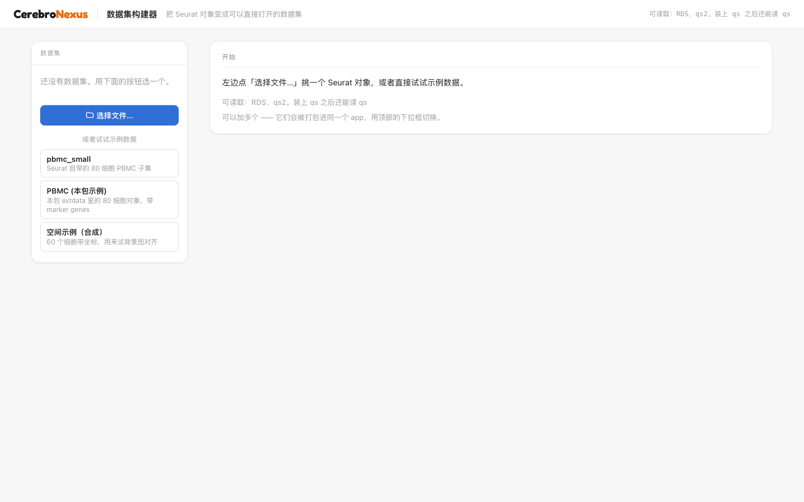
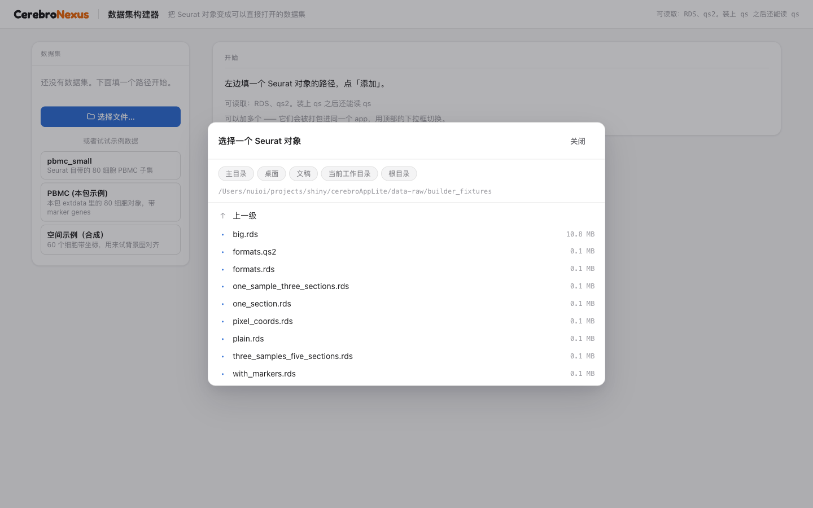
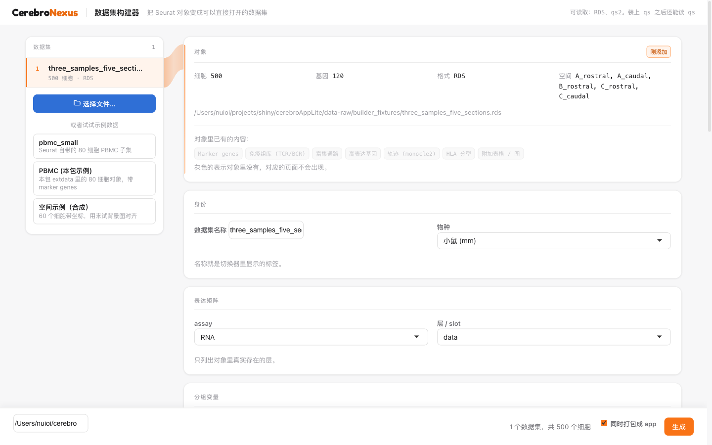
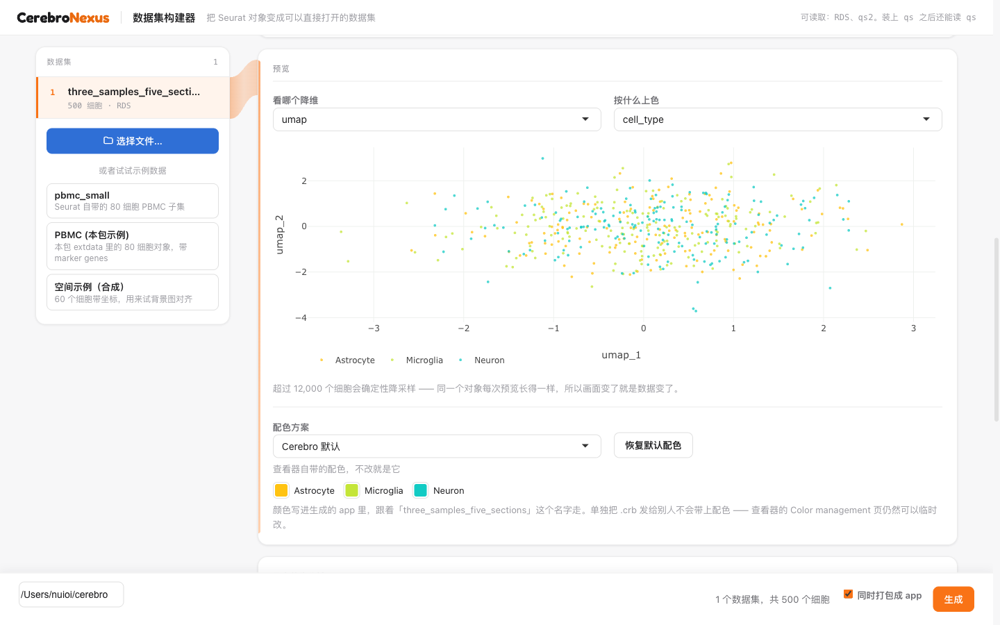
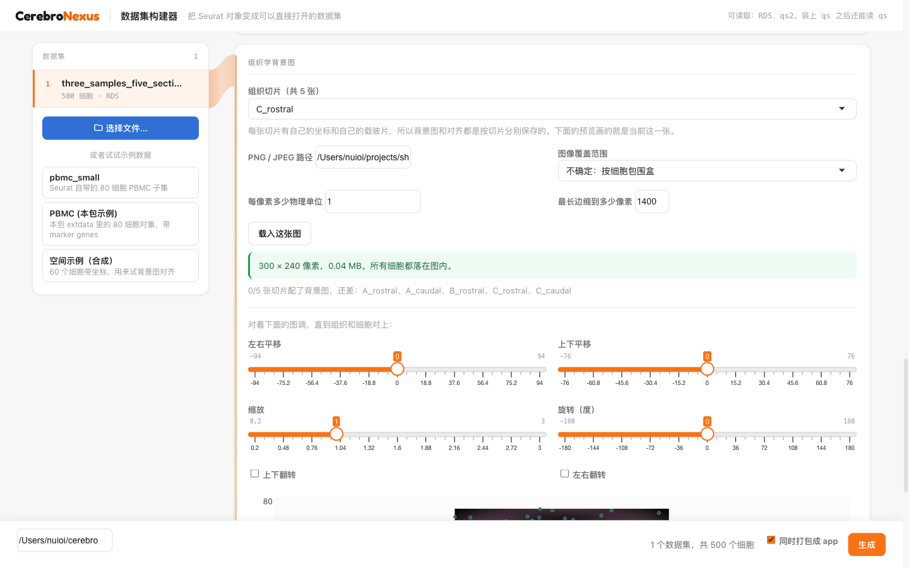
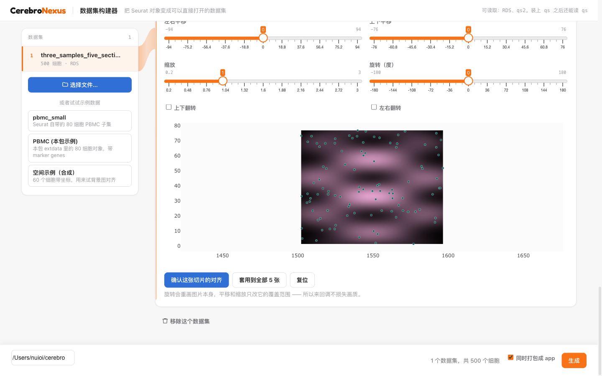

```{r setup, include = FALSE}
knitr::opts_chunk$set(echo = TRUE, eval = FALSE)
```

# What this is

The usual route into CerebroNexus is a call to `exportFromSeurat()` followed by
`createShinyApp()`. That is fifteen arguments to get right, and getting one
wrong — an `assay` that does not exist, a grouping variable that turns out to be
a batch label — is only discovered after the file is written.

The builder is the same pipeline with the arguments turned into a page. You
point at objects, tick what should be in them, look at the projection before
anything is written, and get a runnable app out.

# Running it

```{r}
library(CerebroNexus)
launchCerebroBuilder()
```

That opens a browser on a free port. `launchCerebroBuilder(port = 7799)` pins
one; `launch_browser = FALSE` leaves it closed. From a shell, in one line:

```sh
Rscript -e 'CerebroNexus::launchCerebroBuilder()'
```

> **If you are editing the builder**, note that `launchCerebroBuilder()` runs
> the copy inside the *installed* package — `system.file("builder", ...)` — not
> your working tree. Changes under `inst/builder/` need `R CMD INSTALL .`
> before they appear, and the same applies to anything `createShinyApp()`
> bundles. To skip the reinstall while developing, run the source directly:
>
> ```sh
> Rscript -e 'options(shiny.autoreload = TRUE); shiny::runApp("inst/builder")'
> ```
>
> Saving an `.R` file then reloads the page by itself. Stylesheet and script
> URLs carry the file's own modification time, so CSS and JS changes are not
> served from cache either.



It runs on your own machine. Objects are read in a **separate R process**, so a
multi-gigabyte `readRDS` does not freeze the page — measured on a 15 000-cell
object, the Shiny process grew by 1 MB while the worker took the 97 MB, and the
interface answered throughout.

# Getting objects in

## The file browser

`.rds`, `.qs2`, and `.qs` (the last needs the `qs` package). The browser lists
only files it can actually read, with their sizes, so a directory of mixed
material does not have to be filtered by eye.



> `.qd` is **not** offered and cannot be. qs2's `qdata` format does not
> serialise S4 at all: `qd_save()` on a Seurat object warns *"Objects of type S4
> are not supported in qdata format"*, writes a 38-byte container, and reads
> back as `NULL`. A `.qd` file cannot hold a Seurat object.

## Several objects at once

Add as many as you like. Each becomes its own `.crb` and they are bundled into
one app behind a dataset switcher — one link, every sample behind a dropdown,
which is usually how a lab wants to hand a project over.

The number on each row is the export order, which is also the order of that
switcher. Duplicate names are suffixed automatically, because duplicates do not
merely look untidy: they block the build outright.



## Examples, if you have nothing to hand

Three, needing no files: `pbmc_small` from SeuratObject, the PBMC object shipped
in this package, and a small synthetic spatial object for trying the background
alignment.

An example withdraws from the list once it is on the data set list, and returns
when you remove that data set. An example already loaded is not an offer, and
leaving it there invites loading it twice — which is not merely untidy, because
duplicate names block the build until they are suffixed apart.

# What goes into the data set

Each card is one decision.

**Identity.** The name becomes the switcher label. **Expression matrix.** Only
the layers that really exist in the object are listed. **Grouping variables.**
QC columns are filtered out of the candidates — `nFeature_RNA` is a number, not
a grouping. **Reductions.** Anything with `pca` in its name is unticked by
default, because the export drops it.

# Looking before writing

The preview draws the projection with the palette the app will use. An object
can pass every structural check and still be the wrong object, or be coloured by
something that turns out to be a batch label; one look settles it before a file
exists.

Above 12 000 cells the preview downsamples **deterministically** — the same
object always previews the same way, so a difference on screen is a difference
in the data, not in the sampling.

# Colours



Four palettes, two of them colour-blind-safe (Okabe–Ito and Paul Tol Bright).
Each level also gets its own swatch, and a hand-picked colour **survives a
change of preset** — switching palette re-colours the levels you have not
touched and leaves the ones you have.

Above 40 levels the swatch grid is replaced by a note. Nobody edits 200 colours
one at a time, and 200 colour inputs make the page unusable.

## Where the colours end up, and where they do not

The palette is written into the **generated app's** configuration, via
`createShinyApp(colors = )`. Colours are not part of the `.crb` format — the
class has no colour field and the viewer computes them at runtime — so:

- Open the app the builder produced, and your palette is there.
- Hand someone the bare `.crb`, and they get the default palette.

The viewer's *Color management* tab can still change any colour for that
session; what the builder sets is the starting point, and it is the only part
that persists.

# Spatial: one background per tissue section

An object can hold several tissue sections. Each has its own coordinates and
its own slide, and the `.crb` has always carried a separate histology image and
extent per section — so the builder treats them separately too.

With one section the card looks as it always did. With several, a picker
appears.



Switching section re-reads **that section's** coordinates and clears the
in-progress alignment, which described a different slide. A line under the
controls says how many sections still have no image — worth stating, because a
section without one loses the background picker entirely in the viewer.

## Aligning

Pan, scale, rotate, flip, with the cells drawn over the image in the same
coordinate space the viewer will use. Numbers cannot answer "is this aligned";
only the picture can.



Rotation **redraws the raster**; pan and scale only change the extent it covers
— so moving it back and forth costs no image quality.

Sections cut from one block often share a slide scan, hence *apply to all*;
doing it by hand for twelve sections is the kind of chore that makes people skip
backgrounds entirely. Note what it does and does not share: the **picture** is
copied to every section, the **extent is recomputed for each one** from that
section's own coordinates. Sections sit at different offsets, so copying the
first section's extent would put every other slide hundreds or thousands of
units from its cells — selectable in the viewer and blank on screen. If a
section still has cells outside its image afterwards, it is named in the
notification.

## Choosing the extent

Three ways to say where the image sits:

| Mode | Use when |
|---|---|
| coordinates are image pixels | cell coordinates are literally pixel positions in that image |
| coordinates are physical units | you know the µm per pixel |
| bounding box of the cells | you only know it covers the tissue |

> **On a multi-section object, prefer the bounding box.** In pixel mode every
> section gets `[0, image width]` regardless of where its cells sit, so every
> section but the one near the origin lands completely outside its image. The
> coverage warning reports it per section, but it is easy to walk past.

# Immune repertoire, HLA typing, Trekker

These are not builder controls. They are already on the object when you point at
it, and the builder's job is to carry them through without being asked. What it
shows you is whether they are there: the *what this object already carries* row
lights up the ones it found, and the greyed-out ones are the pages that will not
appear in the finished app.

| On the object | Reaches the `.crb` by |
|---|---|
| `@misc$immune_repertoire`, or legacy `@misc$tcr_data` / `@misc$bcr_data` | `exportFromSeurat()`, on its own |
| `@misc$hla_typing` (+ `@misc$hla_typing_source_type`) | `exportFromSeurat()`, on its own |
| `@misc$trekker` | the builder, written in after the export |

The last row is the odd one out and worth knowing about. `exportFromSeurat()`
never looks at `@misc$trekker`, so an object carrying a Trekker map used to
export without one — and a missing page says nothing about why it is missing.
The builder writes it into the staged `.crb` afterwards, in the same atomic
read-modify-write as any configured histology images. The completed CRBs and
optional app are then published together. This is the same read-modify-write it
uses for the histology background.

Two things follow from the table. A `.crb` produced by a hand-written
`exportFromSeurat()` call will not have Trekker even though the object did; and
which pages appear is decided by what the object carries, not by anything you
tick here.

> Tab visibility has its own logic worth knowing: **HLA & TCR Motifs** appears
> when the data set has a TCR, *not* when it has HLA typing. The motif network
> works without typing, and the page has to be reachable before you can add any.

`data-raw/build_builder_fixtures.R` writes `all_modalities.rds` carrying all
three, if you want to see the three pages light up without hunting for real
data.

# Optional extras

**Analyses before export**, each labelled with what it really costs: percent
mito/ribo and most-expressed genes take seconds, marker genes take minutes, and
Enrichr needs the network (measured: ~4 s for a single database). A step that
fails is logged and skipped — it must not cost you the export.

**Supplementary tables.** Point at a CSV or TSV and it becomes a browsable table
in the Extra material page. Two lines of work, one more page lit up.

# Building

Give an output directory and press the button. Every expensive step — the
analyses, the matrix write, the bundle — happens in the worker, so the page
keeps answering while marker genes take their minutes.

What comes back names each file, its size, how long each analysis took, and
anything that failed. Then:

```{r}
shiny::runApp("~/cerebro/cerebro_app")
```

# Fixtures for trying all of this

The repository carries a generator for a synthetic fixture set that exercises
every path above — no spatial data, one section, three sections from one donor,
five sections across three donors, pixel-exact coordinates, an object arriving
with marker genes, a CSV, and a 15 000-cell object big enough to watch the
worker work:

```sh
Rscript data-raw/build_builder_fixtures.R
```

It builds offline in under a minute. See `data-raw/builder_fixtures.md`.

# Limits worth knowing

- **Local only.** Objects are read from paths on the machine running the app.
  This is a tool for your own machine or your own RStudio Server session, not
  something to deploy for other people.
- **A palette follows the app, not the `.crb`.** See above.
- **Per-section geometry is the extent, and only the extent.** Rotation, flip
  and offset are not stored per section anywhere in the format, which is why
  rotation is baked into the raster and position is expressed as bounds.
- **No cancel button.** A long analysis has to finish; the page stays responsive
  but the work cannot be called back.
