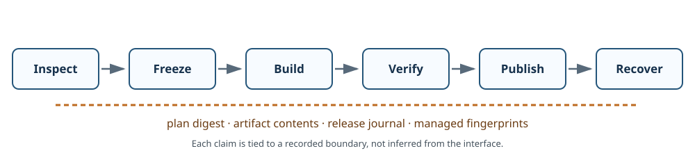
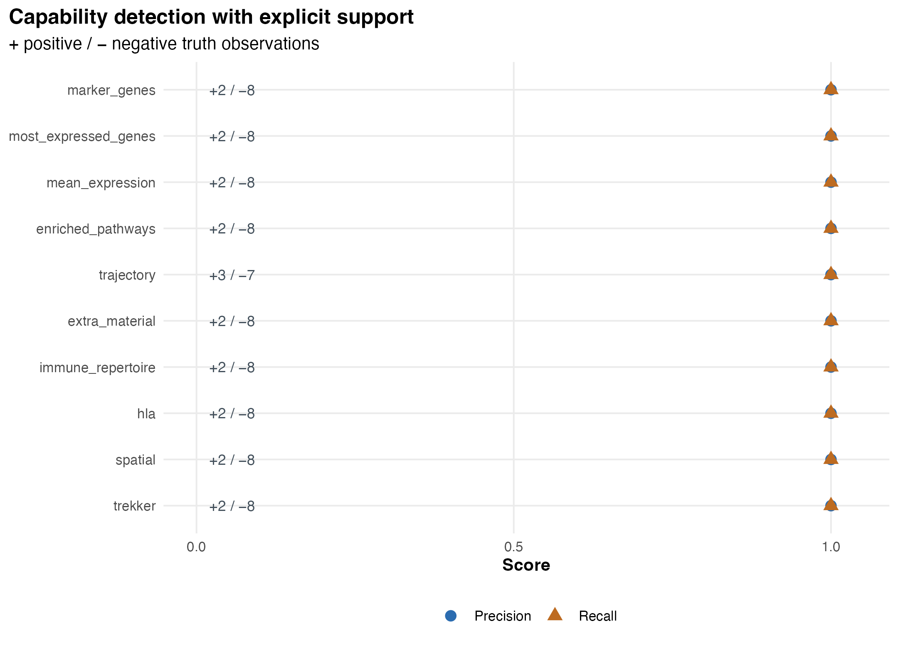
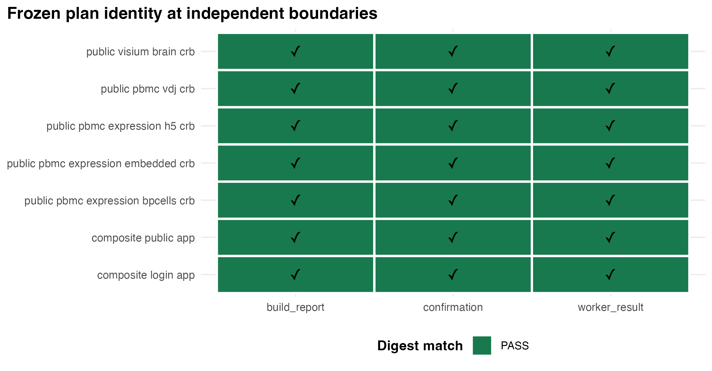
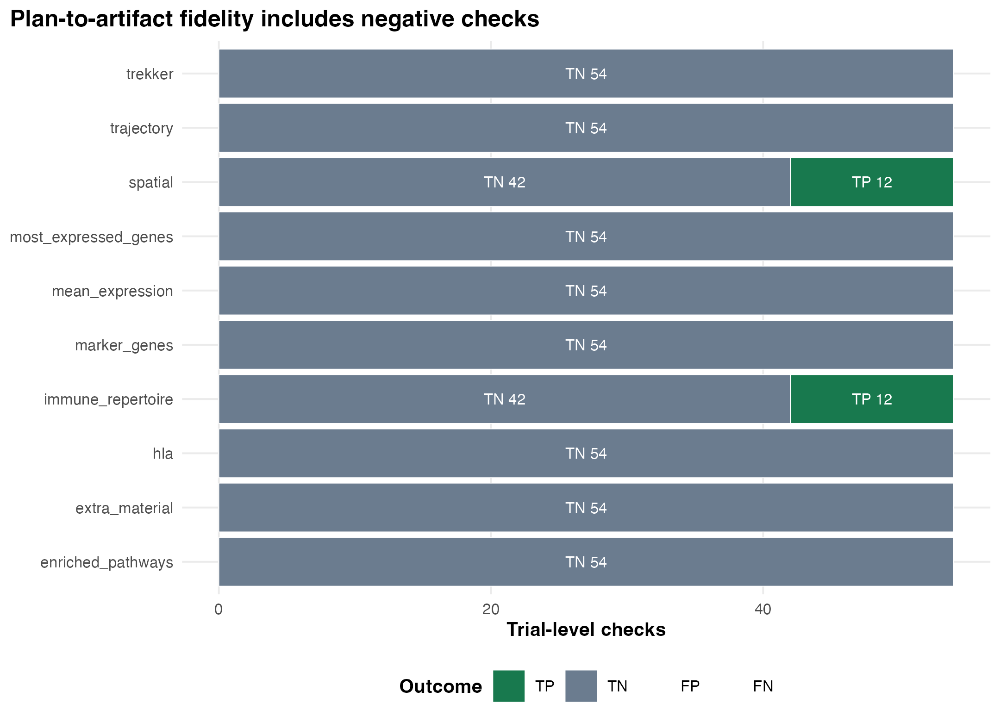
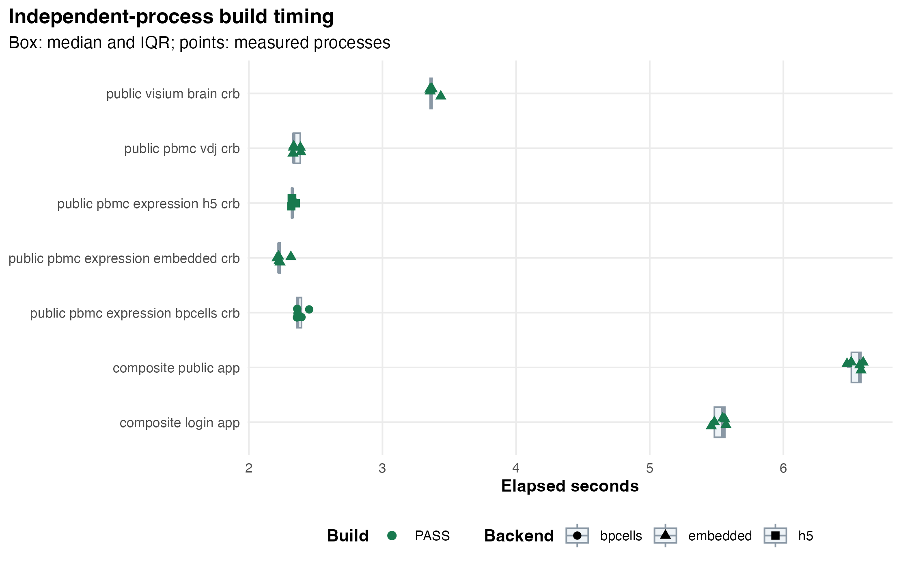
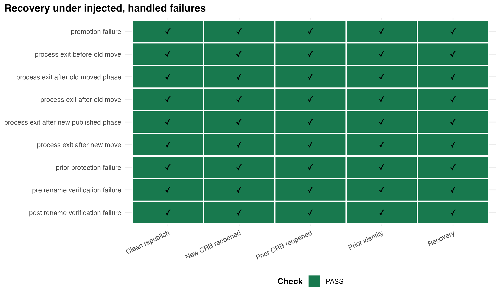
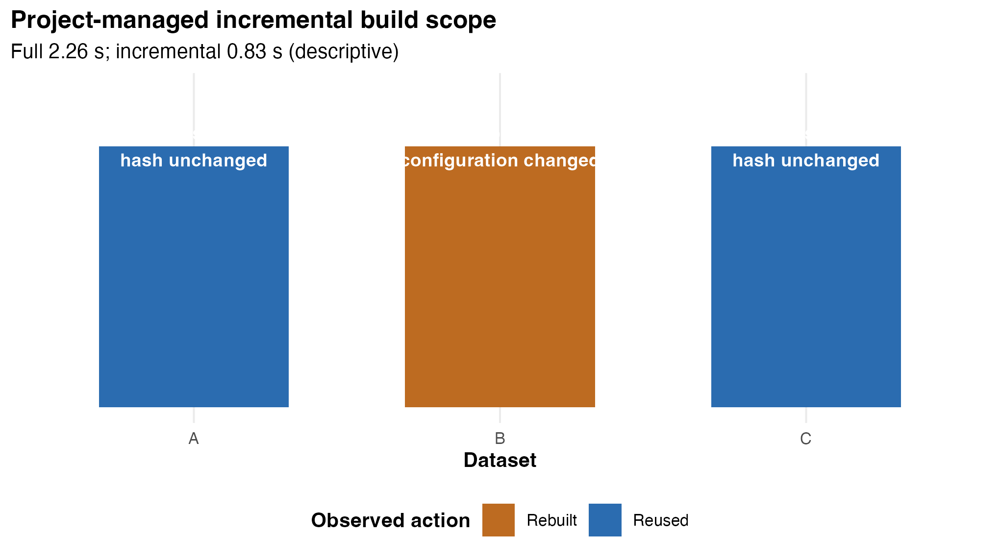
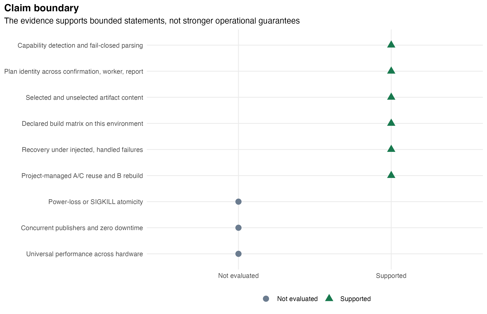

```{r setup, include=FALSE}
knitr::opts_chunk$set(
  collapse = TRUE,
  comment = "#>",
  echo = FALSE,
  fig.align = "center",
  out.width = "100%"
)

evidence_candidates <- c(
  file.path("..", "inst", "extdata", "builder-evaluation", "current"),
  file.path("inst", "extdata", "builder-evaluation", "current"),
  system.file(
    "extdata",
    "builder-evaluation",
    "current",
    package = "CerebroNexus"
  )
)
evidence_root <- evidence_candidates[
  dir.exists(evidence_candidates) &
    file.exists(file.path(evidence_candidates, "validation.json"))
][1]
if (is.na(evidence_root) || !nzchar(evidence_root)) {
  stop("The validated Builder evidence snapshot is unavailable.")
}
validation <- jsonlite::read_json(
  file.path(evidence_root, "validation.json"),
  simplifyVector = TRUE
)
if (!identical(validation$status, "PASS")) {
  stop("The Builder evidence snapshot did not pass validation.")
}
table_names <- c(
  "capability_detection",
  "plan_immutability",
  "artifact_fidelity",
  "build_runs",
  "fault_injection",
  "incremental_rebuild"
)
evidence <- stats::setNames(lapply(table_names, function(name) {
  utils::read.csv(
    file.path(evidence_root, paste0(name, ".csv")),
    stringsAsFactors = FALSE,
    na.strings = ""
  )
}), table_names)
environment <- jsonlite::read_json(
  file.path(evidence_root, "environment.json"),
  simplifyVector = TRUE
)
protocol <- jsonlite::read_json(
  file.path(evidence_root, "protocol.json"),
  simplifyVector = TRUE
)
source_manifest <- jsonlite::read_json(
  file.path(evidence_root, "source_manifest.json"),
  simplifyVector = FALSE
)
fixture_manifest <- jsonlite::read_json(
  file.path(evidence_root, "fixture_manifest.json"),
  simplifyVector = FALSE
)

outcome_counts <- function(rows) {
  as.integer(table(factor(rows$outcome, levels = c("TP", "FP", "FN", "TN"))))
}
metric <- function(numerator, denominator) {
  if (denominator == 0L) NA_real_ else numerator / denominator
}
capability_summary <- do.call(rbind, lapply(
  unique(evidence$capability_detection$capability),
  function(capability) {
    rows <- evidence$capability_detection[
      evidence$capability_detection$capability == capability,
      ,
      drop = FALSE
    ]
    counts <- outcome_counts(rows)
    data.frame(
      capability = capability,
      TP = counts[[1]],
      FP = counts[[2]],
      FN = counts[[3]],
      TN = counts[[4]],
      precision = metric(counts[[1]], counts[[1]] + counts[[2]]),
      recall = metric(counts[[1]], counts[[1]] + counts[[3]]),
      positive_support = sum(rows$truth),
      negative_support = sum(!rows$truth),
      stringsAsFactors = FALSE
    )
  }
))
builds_measured <- evidence$build_runs[evidence$build_runs$measured, , drop = FALSE]
build_summary <- do.call(rbind, lapply(
  split(builds_measured, builds_measured$cell_id),
  function(rows) {
    elapsed <- rows$elapsed_seconds[is.finite(rows$elapsed_seconds)]
    data.frame(
      matrix_cell = rows$cell_id[[1]],
      output = rows$output_type[[1]],
      backend = rows$backend[[1]],
      n = nrow(rows),
      succeeded = sum(rows$success),
      median_s = stats::median(elapsed),
      IQR_s = stats::IQR(elapsed),
      min_s = min(elapsed),
      max_s = max(elapsed),
      stringsAsFactors = FALSE
    )
  }
))
source_table <- if (length(source_manifest$sources)) {
  do.call(rbind, lapply(source_manifest$sources, function(source) {
    data.frame(
      source = unlist(source$source_id, use.names = FALSE),
      provider = unlist(source$provider, use.names = FALSE),
      accession = unlist(source$accession, use.names = FALSE),
      licence = unlist(source$license, use.names = FALSE),
      cells = as.integer(unlist(source$cells, use.names = FALSE)),
      features = as.integer(unlist(source$features, use.names = FALSE)),
      object_SHA256 = unlist(source$object_sha256, use.names = FALSE),
      stringsAsFactors = FALSE
    )
  }))
} else {
  data.frame()
}
```

# Scientific question and bounded claims

The practical question is not how many controls the CerebroNexus Builder has.
It is whether a scientist can move from an inspected single-cell object to a
release whose meaning can be checked, traced, and recovered when publication
does not finish normally.

We evaluated six bounded claims:

1. supported input capabilities are detected, while malformed optional content
   fails closed;
2. the plan confirmed at Review has the same portable identity in the worker
   result and reread build report;
3. selected content is present and unselected content is absent in the built
   artifact;
4. the declared CRB, public-App, login-App, embedded, HDF5, and BPCells matrix
   cells complete on the recorded environment;
5. recovery under injected, handled failures preserves and reopens the prior
   CRB before a subsequent clean publication; and
6. a three-dataset project reuses unchanged A/C artifacts and rebuilds only
   changed B through the project-managed artifact path.

These are software-evaluation claims tied to the exact Git revision,
dependencies, host, public-source hashes, and experimental units stored with
this vignette. They are not universal biological-performance claims.

```{r evidence-chain}

```

# Using Builder from import to safe publication

The user workflow has six evidence-bearing stages.

## Import and Inspect

Launch the local authoring application with
`CerebroNexus::launchCerebroBuilder()`, then add trusted Seurat objects or use
the shipped example gallery. Inspection reports cells, features, assays,
metadata, reductions, spatial sections, immune-repertoire content, HLA,
trajectories, supplementary tables, and blockers. The Builder creates a
session-private snapshot only after the source has loaded and its complete
storage closure can be frozen.

The Builder deserializes R objects and is therefore a local trusted-input tool,
not a public upload service.

## Configure Core and Enhance

Core records the dataset identity, assay/layer, metadata groups, default
projection, organism, QC fields, and expression backend. Enhance separates
content already present on the object from analyses or attachments the user
explicitly opts into. Invalid or ambiguous optional structures do not become
silent best guesses.

## Review and Freeze

Review is an exact BuildPlan: dataset order, filenames, content dispositions,
analysis dependencies, backend/sidecars, App mode, authentication choice, and
portable targets. Confirmation freezes that plan. Later changes to the source
object or editable entry cannot mutate the request already sent to Build.

## Build and Verify

The worker opens the owned snapshot, runs the real preparation and export
hooks, verifies each CRB and sidecar, and optionally assembles a public or
login-protected App. A build report is created only if the worker's plan digest
matches the plan used to construct the report.

## Publish and Recover

Publication occurs from a private same-filesystem stage. The prior release is
protected, the new payload is verified before and after rename, and the release
journal records the transaction phase. A recoverable interrupted transaction
must be explicitly restored or aborted before another publication begins.

For an operational button-by-button guide, see the companion vignette
*Build a data set without writing code*. This article focuses on why the
workflow supports the scientific claims above.

# Why frozen plans and negative checks matter

A successful export alone does not establish that the artifact corresponds to
what the user confirmed. We therefore record one canonical, redacted plan
digest at three independently observed boundaries:

```text
Review confirmation -> worker result -> reread build-report.json
```

The digest includes review-visible settings and portable output choices. It
excludes absolute paths, source locations, credentials, process IDs, locks,
and transient worker fields. It is an audit key, not a digital signature.

Artifact evaluation also scores absence. For every capability the frozen plan
defines whether content was selected; the completed CRB is read back and
tested for both intended inclusion and unintended inclusion. Without TN/FP
checks, an exporter that copied every optional slot could look perfectly
sensitive while violating the user's Review choices.

# Evaluation methods

## Synthetic truth and malformed challenges

Ten small deterministic Seurat fixtures declare truth independently of Builder
inspection. Each scored capability has at least two positive and two negative
truth observations. Seven separate malformed or ambiguous challenges exercise
marker, trajectory, supplementary-content, spatial, Trekker,
immune-repertoire, and HLA parsers. Truth is never derived from the Builder
profile being evaluated.

The detection table retains TP, FP, FN, and TN for every
fixture-by-capability unit. Undefined precision or recall remains `NA`; it is
not converted to a perfect score. Macro summaries average only defined
capability metrics and disclose their denominator.

## Public-data confirmation

The publication profile adds three CC BY 4.0 source families: 10x PBMC gene
expression, one 10x Visium mouse-brain sagittal-anterior section distributed
through `stxBrain.SeuratData` 0.1.2, and a matched 10x PBMC 5-prime
gene-expression/TCR/BCR case. Acquisition URLs and archive SHA-256 values are
pinned; downloads are completed to `.part`, verified, then renamed in a
caller-owned cache. The package snapshot contains provenance and hashes, not
the public matrices. Downloaded 10x matrices use stable feature identifiers.
For transport evaluation only, every public object also receives a declared,
deterministic two-level technical grouping and two-dimensional technical
coordinates. These controls are recorded on the object and are not presented
as a biological clustering or embedding.

```{r public-source-table, results='asis'}
if (nrow(source_table)) {
  knitr::kable(
    source_table,
    digits = 0,
    caption = "Public-data confirmations recorded in the publication run."
  )
}
```

Synthetic fixtures retain responsibility for exact ground truth; the public
cases test practical transport through representative data structures.

## Experimental units and statistics

The preregistered publication matrix contains seven cells. Each has one
recorded warm-up excluded from timing summaries, followed by five measured
independent R processes.
Execution order rotates across repetitions. Timing is operational and
descriptive: we report count, median, IQR, minimum, and maximum, with no
significance test. Input/output bytes, backend, failure stage, and report
identity remain in the raw rows.

The public PBMC expression case is built with embedded, HDF5, and BPCells
storage; Visium and matched V(D)J receive CRB builds; two representative
multi-dataset cases receive public-App and login-App builds. An unavailable
declared backend is a publication failure, not a silently dropped matrix cell.

# Capability-detection results

Across `r nrow(evidence$capability_detection)` declared
fixture-by-capability units, the observed counts were
`r paste(c("TP", "FP", "FN", "TN"), outcome_counts(evidence$capability_detection), sep = "=", collapse = ", ")`.
The per-capability table exposes the positive and negative support behind each
score.

```{r capability-table, results='asis'}
knitr::kable(
  capability_summary,
  digits = 3,
  caption = "Capability-level truth support and detection performance."
)
```

```{r capability-figure}

```

The balanced support is important: a perfect micro result cannot hide a
capability observed only once. Malformed challenge outcomes are retained in
the fixture manifest and tests, while this table reports the orthogonal valid
truth matrix.

# Plan identity and artifact fidelity

The publication run recorded `r nrow(evidence$plan_immutability)` plan-boundary
observations. All confirmation, worker-result, and reread-report digests matched
their corresponding confirmation digest, and mutation of the original entry
and source object after freezing did not propagate into the plan.

```{r plan-identity-figure}

```

The completed artifacts contributed
`r nrow(evidence$artifact_fidelity)` content checks. Their outcome counts were
`r paste(c("TP", "FP", "FN", "TN"), outcome_counts(evidence$artifact_fidelity), sep = "=", collapse = ", ")`.
Thus the fidelity result includes both preserved selected content and absence
of unselected content.

```{r artifact-fidelity-figure}

```

# Build and publication results

All `r nrow(builds_measured)` measured processes are retained as experimental
units. Success is defined jointly: the real worker returned a publishable
result, `build-report.json` was constructed, its identity and plan digest were
validated on reread, and the expected CRB/App outputs existed.

```{r build-summary-table, results='asis'}
knitr::kable(
  build_summary,
  digits = 3,
  caption = "Independent-process build results and descriptive timing."
)
```

```{r build-timing-figure}

```

These timings describe the recorded environment only: R
`r environment$r_version`, package `r environment$package_version`, Git
`r substr(environment$git_sha, 1, 12)`. They should help reproduce and budget
the workflow, not rank software or predict another host.

# Recovery under injected, handled failures

We tested `r nrow(evidence$fault_injection)` deterministic transaction
boundaries: prior-release protection, pre-rename verification, promotion,
post-rename verification, and five journal transitions in independent child
processes. Each scenario began with a genuine Builder CRB as the prior release
and staged a different genuine CRB as the candidate.

After injection, the evaluator recorded the prior release identity and CRB
hash, reopened the restored CRB, checked formal-target and
stage/lock/backup/retired-backup residue, and then completed a fresh clean
publication and reopened the new CRB.

```{r recovery-figure}

```

The supported wording is deliberately narrow: **recovery under injected,
handled failures**. The child-process exits test journal recovery after the
process owner disappears, but they do not establish atomicity for arbitrary
`SIGKILL`, kernel failure, storage-device loss, or power loss.

# Project-managed incremental rebuilding

The control build exported real CRBs for datasets A, B, and C through the
default Builder hooks. Each artifact was registered with
`builder_project_store_artifact_bundle()`, creating an immutable,
content-addressed project generation with managed fingerprints. The evaluator
then changed only B's object/configuration identity, materialized the next real
plan, and executed it without custom export or verification hooks.

```{r incremental-table, results='asis'}
incremental_table <- evidence$incremental_rebuild[, c(
  "dataset",
  "expected_reused",
  "actual_reused",
  "expected_rebuilt",
  "actual_rebuilt",
  "configuration_changed",
  "hash_preserved",
  "scope_correct"
)]
knitr::kable(
  incremental_table,
  caption = "Expected and observed project-managed incremental scope."
)
```

```{r incremental-figure}

```

A and C were copied from their managed generations with unchanged hashes; B
was rebuilt after its configuration digest changed. The paired full and
incremental times are descriptive observations from this three-dataset
control, not a general speedup estimate.

# Limitations and unsupported stronger claims

```{r claim-boundary-figure}

```

The experiment does not support the following stronger claims:

- crash atomicity under arbitrary `SIGKILL`, operating-system failure, or
  power loss;
- correctness with concurrent publishers targeting the same release;
- zero-downtime replacement while readers hold old CRB/sidecar handles;
- universal runtime, memory, or storage performance across machines;
- correctness for every Seurat extension or every future file layout;
- biological validity of upstream annotations or analyses supplied by users;
- security of the deployment platform beyond the generated App's tested
  private-bundle and optional-login contracts.

Peak memory was not sampled in this experiment. Timing is not a benchmark
comparison and was not analyzed inferentially. Public-data inputs are
deterministic 200-cell subsets by default, which exercise structure and
transport but not large-cohort scalability. The separate expression-backend
benchmark vignette addresses scale with a different protocol.

# Reproduction, data and code availability

The complete machine-readable snapshot used here is installed under
`inst/extdata/builder-evaluation/current` in the source tree and under
`system.file("extdata", "builder-evaluation", "current", package =
"CerebroNexus")` after installation. It contains protocol/environment/source/
fixture JSON, all trial-level CSVs, portable build reports, validation status,
summary text, and the figure inputs/outputs. It contains no CRBs, source
matrices, credentials, or absolute local paths.

From a clean checkout at the recorded Git SHA:

```{r reproduction-commands, eval=FALSE, echo=TRUE}
# Caller-owned cache; public downloads are SHA-256 verified.
cache <- "/path/to/builder-public-cache"
run <- file.path(
  "results",
  "builder",
  paste0(substr(system("git rev-parse HEAD", intern = TRUE), 1, 12),
         "-publication")
)

system2(
  "Rscript",
  c(
    "validation/builder/run.R",
    "--profile", "publication",
    "--cache", cache,
    "--output", run
  )
)
system2(
  "Rscript",
  c("validation/builder/publish.R", "--run", run)
)
rmarkdown::render("vignettes/builder_publication_evaluation.Rmd", quiet = TRUE)
```

The evaluator refuses to overwrite an existing result directory, refuses a
dirty publication worktree, requires every preregistered repetition and
backend, preserves failures in raw rows, and updates the package `current`
snapshot only after schema, joins, gates, summaries, reports, and figures have
been reread and validated.

Public data remain at their providers under CC BY 4.0; URLs, accession labels,
preparation rules, file sizes, and SHA-256 values are recorded in
`source_manifest.json`. Code is available with CerebroNexus under the package
license. These arrangements follow the [Nucleic Acids Research Web Server
issue expectations](https://academic.oup.com/nar/pages/submission_webserver)
for extensive testing and reproducible use cases and the journal's [data, code,
and parameter availability
guidance](https://academic.oup.com/nar/pages/data_deposition_and_standardization);
a Genome Biology submission can cite the same snapshot as Supplementary
Software Evaluation.
