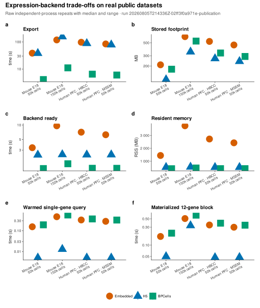
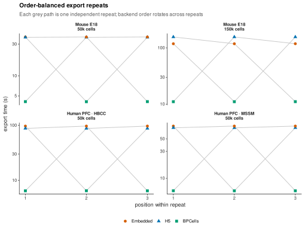
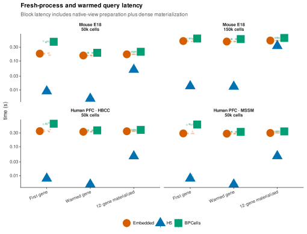
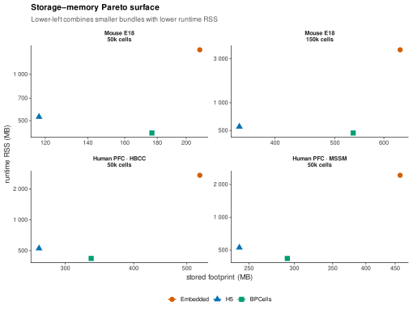
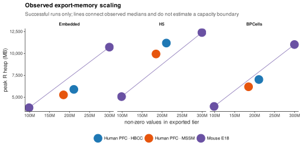
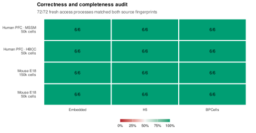

```{r, include = FALSE}
knitr::opts_chunk$set(
  collapse = TRUE,
  comment = "#>",
  eval = FALSE
)
```

> **Short answer: start with `h5`.** It is the best general default when HDF5Array is available: the validated run produced the smallest bundles and fastest single-gene reads while keeping the matrix lazy.
>
> - Use `embedded` when you need one portable file and the matrix fits comfortably in memory.
> - Use `bpcells` when export speed and the lowest ready-state memory matter most and a directory sidecar is acceptable.

# Overview

`exportFromSeurat()` and `convertSeuratToCerebro()` can store the expression matrix as `"embedded"`, `"bpcells"`, or `"h5"`. The three modes expose the same Cerebro expression interface, but they differ in packaging, runtime dependencies, and when matrix values enter memory.

There is no universal fastest backend. Query shape, matrix density, storage, operating-system cache, package versions, and deployment hardware can all change the result. This guide therefore starts from stable format properties and uses one validated immutable publication run only as conditional evidence for a recorded host and workload.

# Decision table

| Backend | Storage layout | Runtime representation | Main reason to choose it | Main constraint |
|---|---|---|---|---|
| `embedded` | one `.crb` file | expression matrix is stored in the serialized object | the deployment must be a single self-contained file | loading the CRB also loads its expression matrix |
| `bpcells` | `.crb` plus a sibling `.bpcells/` directory | BPCells opens the matrix directory | a directory sidecar and the BPCells runtime fit the deployment | the CRB and the complete directory must move together |
| `h5` | `.crb` plus a sibling `.h5` file | HDF5Array opens a lazy TENx matrix | a portable HDF5 sidecar and lazy access fit the deployment | the CRB and H5 file must move together and HDF5Array must be installed |

Use `embedded` when one-file portability is more important than lazy loading and the matrix is comfortably within the deployment's memory budget. Consider `bpcells` when a directory sidecar is operationally acceptable and BPCells is already part of the runtime. Consider `h5` when a single external HDF5 file and TENx-compatible storage are useful. For a consequential deployment, measure the actual data and workload rather than relying on a backend label alone.

# Export examples

The backend is selected through `expression_matrix_mode`.

```{r}
exportFromSeurat(
  object = seurat_object,
  file = "dataset.crb",
  expression_matrix_mode = "embedded"
)
```

```{r}
exportFromSeurat(
  object = seurat_object,
  file = "dataset.crb",
  expression_matrix_mode = "bpcells"
)
```

```{r}
exportFromSeurat(
  object = seurat_object,
  file = "dataset.crb",
  expression_matrix_mode = "h5"
)
```

The external modes create a sibling artifact beside the CRB. Treat the CRB and sibling as one deployment unit: copying, renaming, archiving, or publishing only one part produces an incomplete data set.

# Questions to answer before choosing

## Must the data set be one file?

If the delivery system accepts only one file, use `embedded`. If a sibling file or directory is acceptable, the external backends keep the expression matrix outside the serialized CRB.

## Which runtime packages are available?

An embedded matrix needs no external expression-backend package after the CRB is loaded. A BPCells sidecar needs BPCells. An H5 sidecar needs HDF5Array and its HDF5 stack. Confirm those packages in the deployment environment before publishing the app.

## Does the matrix fit comfortably in memory?

Cell count alone is not a sufficient size measure. The number of non-zero matrix entries and the temporary copies made during export can dominate memory. A `dgCMatrix` also uses 32-bit sparse indices, so a matrix with more than `.Machine$integer.max` non-zero entries cannot be represented as one `dgCMatrix`, regardless of installed RAM.

Changing the output backend does not by itself remove every export-time limit. The current export path first receives an in-memory object; a future streaming export path would be a separate capability.

## What does the app actually read?

A single-gene lookup, a multi-gene marker table, initial CRB loading, and repeated interactive queries are different workloads. Compare the operations used by the intended Cerebro views. Do not infer interactive performance from file size or export time alone.

# Benchmark evidence

CerebroNexus keeps its real-data benchmark in the same source repository under [`tools/bench/`](https://github.com/duocang/CerebroNexus/tree/benchmark-evidence-20260805-02ff3f0/tools/bench). It is repository-only research infrastructure rather than installed package code, so it can carry remote readers, multi-gigabyte source definitions, resource planning, failure records, and dedicated tests without adding those dependencies to the user package.

The benchmark compares all three backends on public count and normalized matrices. It records export, load, attach, memory, disk, single-gene, and block-read measurements in independent processes, and it rejects results whose expression fingerprints differ from the source.

## Qualifying publication run

> **Evidence status.** The complete immutable [`20260805T214336Z-02ff3f0a971e-publication`](https://github.com/duocang/CerebroNexus/tree/benchmark-evidence-20260805-02ff3f0/tools/bench/result/runs/20260805T214336Z-02ff3f0a971e-publication) run passed all 36 export checks and all 72 source-matrix fingerprint checks, with no recorded child-process crashes. The archived pilot remains available for provenance but does not support package recommendations.

A numerical result may enter this guide only when it comes from a validated immutable publication run that records the exact CerebroNexus Git SHA, dependency-environment revision, source checksums, host, schedule, raw measurements, generated tables, and generated figures. The package documentation must link to that named run or a tagged benchmark release.

## Tested data and host

The run used one public raw-count matrix and two public normalized matrices. Complete sources were inspected and fingerprinted, then bounded cell tiers were exported because all three complete matrices exceed the 32-bit non-zero index limit of one `dgCMatrix`.

| Source | Matrix values | Complete cells | Genes | Complete non-zero values | Measured tiers |
|---|---|---:|---:|---:|---:|
| 10x mouse brain E18 | raw integer counts | 1,306,127 | 27,998 | 2.625 billion | 50k, 150k |
| Human PFC cross-disorder, HBCC | normalized floating point | 1,486,324 | 34,176 | 6.112 billion | 50k |
| Human PFC cross-disorder, MSSM | normalized floating point | 4,140,453 | 34,176 | 15.60 billion | 50k |

Measurements ran on Linux with an Intel Core i7-14700, 28 logical cores, 128 GB RAM, R 4.6.1, and CerebroNexus 3.2.0. This is the historical measurement environment recorded by the immutable evidence tag; version 4.1 packages the guide and harness without relabelling those results. Source files totalled 54.5 GB and are pinned by SHA-256 in the run's [`source_manifest.csv`](https://github.com/duocang/CerebroNexus/blob/benchmark-evidence-20260805-02ff3f0/tools/bench/result/runs/20260805T214336Z-02ff3f0a971e-publication/source_manifest.csv).

## How to read the measurements

Each export value below is the median of three independent export processes. Each runtime value is the median of six fresh access processes: two access repeats for each exported artifact. Backend order rotates across export repeats. "Ready" is CRB load plus external-backend attachment; it excludes the Shiny handshake and browser rendering. "Warmed gene" is the per-process median of repeated single-gene reads. "12-gene block" includes native-view preparation and dense materialization.



## Complete measured comparison

This compact table keeps all four tested source/tier points and all three backends together. The immutable [`summary.md`](https://github.com/duocang/CerebroNexus/blob/benchmark-evidence-20260805-02ff3f0/tools/bench/result/runs/20260805T214336Z-02ff3f0a971e-publication/summary.md) additionally reports the observed minimum and maximum for every median.

```{r child='figures/backend/complete-comparison.md'}
```

## Observed trade-offs

The publication run tested three public matrices at 50,000 cells and the mouse-brain matrix at 150,000 cells on an Intel Core i7-14700 host with 128 GB RAM and R 4.6.1. Within those four source/tier points:

- BPCells had the shortest export times (4.1-11.1 seconds) and the lowest resident memory after backend readiness (416-470 MB).
- H5 produced the smallest CRB-plus-sidecar totals (117.3-350.3 MB) and the lowest warmed single-gene medians (0.005-0.013 seconds).
- Embedded storage kept the expression matrix in one CRB, but its measured backend-ready time (3.36-9.65 seconds) and resident memory (1,444-3,755 MB) were higher than both external backends at every tested point.

These observations describe this exporter, host, source set, cell tiers, and query plan. They are not universal backend rankings. In particular, the operating-system file cache was uncontrolled, so the latency values are not cold-disk measurements. The successful tiers also do not establish a maximum supported capacity.

### Export order and repeat stability

Every backend occupied each order position once per source/tier. The light paths connect the three independent repeats; they make the deliberately rotated order visible rather than hiding it behind an aggregate.



### Interactive query shapes

The query panel separates first-gene, warmed-gene, and fully materialized 12-gene access. H5 was fastest for the tested gene queries, while BPCells' main advantages in this run were export time and ready-state RSS. These are server-side matrix timings, not whole-page Shiny latency.



### Storage and runtime memory

Stored footprint and ready-state RSS are separate deployment costs. H5 occupied the left side of every panel because it produced the smallest bundle, while BPCells occupied the lower side because it used the least ready-state RSS. Embedded storage was larger on both axes at these points but retained the operational benefit of one CRB without a matrix sidecar.



### Observed export-memory scaling

Across the four distinct source/tier points, the median observed export peak was 36.9 bytes per non-zero value, with a 35.0-42.0 range. Lines connect measured medians only. They do not estimate a safe capacity or failure boundary.



### Correctness and completeness

Speed is accepted only after value identity. Every fresh access process reproduced both its single-row and 12-row source fingerprints. The resulting 72/72 grid is a correctness audit, not a performance score.



# Raw evidence and reproduction

The named run retains the complete schedule and machine-fit decision, all raw process rows, environment and source manifests, generated report, and figures:

- [`05_schedule.csv`](https://github.com/duocang/CerebroNexus/blob/benchmark-evidence-20260805-02ff3f0/tools/bench/result/runs/20260805T214336Z-02ff3f0a971e-publication/05_schedule.csv): requested source, tier, backend, repeat, and order position;
- [`resource_check.csv`](https://github.com/duocang/CerebroNexus/blob/benchmark-evidence-20260805-02ff3f0/tools/bench/result/runs/20260805T214336Z-02ff3f0a971e-publication/resource_check.csv): pre-download memory, index, and disk gate;
- [`10_export.csv`](https://github.com/duocang/CerebroNexus/blob/benchmark-evidence-20260805-02ff3f0/tools/bench/result/runs/20260805T214336Z-02ff3f0a971e-publication/10_export.csv): 36 raw export-process rows;
- [`20_access.csv`](https://github.com/duocang/CerebroNexus/blob/benchmark-evidence-20260805-02ff3f0/tools/bench/result/runs/20260805T214336Z-02ff3f0a971e-publication/20_access.csv): 72 raw access-process rows and fingerprints;
- [`run_manifest.csv`](https://github.com/duocang/CerebroNexus/blob/benchmark-evidence-20260805-02ff3f0/tools/bench/result/runs/20260805T214336Z-02ff3f0a971e-publication/run_manifest.csv): exact Git, dependency-environment, package, R, OS, CPU, and memory provenance.

To reproduce or adapt the protocol, start with the repository-only [`tools/bench/README.md`](https://github.com/duocang/CerebroNexus/blob/benchmark-evidence-20260805-02ff3f0/tools/bench/README.md) and [`METHODOLOGY.md`](https://github.com/duocang/CerebroNexus/blob/benchmark-evidence-20260805-02ff3f0/tools/bench/METHODOLOGY.md). The harness performs resource preflight before downloading complete matrices and publishes a run only after measurement, report, and figure validation.

# Interpreting results

Treat performance claims as conditional on the source, tier, density, access pattern, software environment, and host. A publication profile compares backends on tiers expected to complete. A separate stress profile may measure an observed failure boundary. A capacity calculated from successful points is an estimate, not an observed stopping boundary.

This separation matters because a backend can trade slower export for lower runtime memory, or favour block reads over individual rows. A useful result describes that trade-off and the tested scenario instead of declaring one backend globally best.

# Related benchmark design

Cakir et al. compared single-cell web visualization tools using preparation time, peak memory, scaling tiers, and user-facing capabilities rather than one aggregate score: [Comparison of visualization tools for single-cell RNAseq data](https://doi.org/10.1093/nargab/lqaa052). The CerebroNexus harness has a narrower purpose—it compares storage backends inside one application—but follows the same principle that system measurements and user-visible workloads should be interpreted together.
