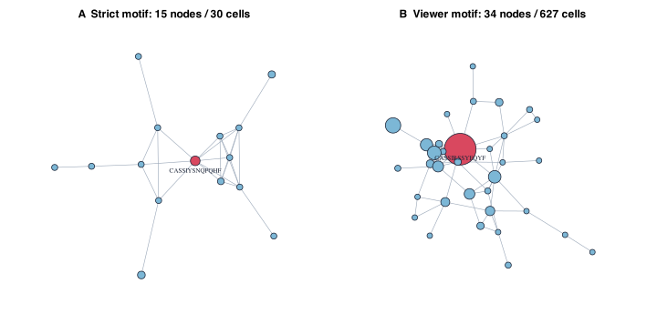

```{r setup, include = FALSE}
knitr::opts_chunk$set(collapse = TRUE, comment = "#>", eval = FALSE)
evidence_candidates <- c(
  file.path("..", "inst", "extdata", "examples",
            "demo_hla_tcr_publication.manifest.json"),
  system.file("extdata", "examples",
              "demo_hla_tcr_publication.manifest.json",
              package = "CerebroNexus")
)
evidence_file <- evidence_candidates[file.exists(evidence_candidates)][1]
publication <- jsonlite::fromJSON(evidence_file, simplifyVector = FALSE)
viewer_case <- publication$viewer_case
strict_case <- publication$strict_case
sequences <- read.csv(
  file.path(dirname(evidence_file), "demo_hla_tcr_publication.sequences.csv"),
  stringsAsFactors = FALSE
)
viewer_sequences <- sequences[sequences$case_id == "viewer-expanded-clone", ]
viewer_dominant <- viewer_sequences[which.max(viewer_sequences$cell_count), ]
```

# The result first

This walkthrough follows one measured T-cell population through the whole
Viewer: a gene-defined expanded clone in Linked views, its sequence context in
HLA & TCR Motifs, and an anonymous link that reopens the same
`r viewer_case$cell_count` cells for a collaborator.

The source is the bundled `HLA & TCR` data set:
`r format(publication$dataset$cell_count, big.mark = ",")` real CD8 T cells from
four donors, with transcriptomes, paired alpha/beta TCR contigs, raw dextramer
binder calls, and independently published donor HLA genotypes. For the raw-data
provenance, build pipeline, and source-specific caveats, read
`vignette("hla_tcr_antigen_selected")` first.

The case is versioned as two small files:

```{r case-files}
system.file(
  "extdata/examples/demo_hla_tcr_main_case.linked-view.json",
  package = "CerebroNexus"
)
system.file(
  "extdata/examples/demo_hla_tcr_main_case.expectations.json",
  package = "CerebroNexus"
)
```

The first is a normal Linked views configuration that a user can import. The
second is a machine-readable record of the expected counts and sequence family.

The case is meant to be read through the interface, not only through the JSON:
the real Viewer exposes the UMAP and clonal expansion panels as one linked
workspace.

## Keep this case separate from the strict TRB case

This is the **older, broader** end-to-end story in the repository. It is not the
same endpoint as the strict TRB clonotype in
`vignette("hla_tcr_antigen_selected")`:

| case | selection definition | size | biological use |
|---|---|---:|---|
| this vignette | `CTgene` gene-defined clone | `r viewer_case$cell_count` cells | explain expansion, sequence diversity, and sharing |
| antigen-selected vignette | exact TRB V/J/CDR3 | `r strict_case$cell_count` cells | explain a stable sequence-defined selection |

Both cases start from the same
`r format(publication$dataset$cell_count, big.mark = ",")`-cell real data set.
The `r viewer_case$cell_count`-cell case is
the right one for the large Linked views walkthrough; the
`r strict_case$cell_count`-cell case is the
right one for the strict `TRBV19 / TRBJ1-5 / CASSIYSNQPQHF` endpoint. Their
counts and claims must not be merged.


*Figure 1. Real data → broader CTgene clone → expansion and sequence diversity
→ TRB motif and UMAP context → portable barcode/JSON selection → Linked views
sharing.*


*Figure 2. The real `r format(publication$dataset$cell_count, big.mark = ",")`-cell
workspace before importing the fixed case.*

# The biological question

The deliberately narrow question is:

> Can an expanded, gene-defined TCR clone be located in the transcriptomic
> workspace, resolved into its TRB CDR3 sequence family, and shared as the same
> cell population with another viewer?

The selected clone uses the application's default `cloneCall = "gene"`
contract. Its `CTgene` identity is:

```text
TRAV27.TRAJ42.TRAC_TRBV19.None.TRBJ2-7.TRBC2
```

It contains `r viewer_case$cell_count` cells:
`r viewer_case$donor_counts$donor1` from donor1 and
`r viewer_case$donor_counts$donor2` from donor2. All selected cells have the
raw `Flu-MP_Influenza` binder label, and the restricting allele named by that
reagent is present in both donors' published genotypes.

The selection is deliberately broader than an exact sequence clonotype: it
contains `r nrow(viewer_sequences)` distinct TRB CDR3 sequences. Its dominant
sequence is `r viewer_dominant$cdr3` (`r viewer_dominant$cell_count` cells), and
its nearby motif family contains `r viewer_case$motif$node_count` TRB nodes and
`r viewer_case$motif$cell_count` cells across donor1, donor2, and donor4. This
is a useful expansion and sharing example, not evidence that all selected cells
carry one identical TRB
sequence.

That observation is useful context, not proof of peptide specificity. A raw
binder label records staining by a reagent. A raw binder call is reagent
staining, not validated peptide specificity.

# Open the fixed selection

Launch the bundled Viewer from a source checkout:

```bash
Rscript -e 'pkgload::load_all("."); shiny::runApp("inst", port = 3838, launch.browser = TRUE)'
```

Then:

1. Select the **HLA & TCR** data set.
2. Open **Linked views**.
3. Press **Share selection**.
4. Under *Import or export a view*, press **Open JSON**.
5. Choose
   `inst/extdata/examples/demo_hla_tcr_main_case.linked-view.json`.

The imported configuration selects exactly `r viewer_case$cell_count` cells,
colours them by `sample`,
opens the UMAP projection, and keeps the clonal layout in **Rank stack** mode.
The selected clone is rank six by the application's gene-level clone definition.

The portable JSON contains selected cell barcodes and view settings. It does not
contain the expression matrix, projection coordinates, image pixels, or local
paths; those remain in the matching `.crb` data set.

# Read the clone at the right level

The clonal panel and the motif network answer related but different questions:

| Layer | Identity | What this case contains |
|---|---|---|
| Linked views clone | `CTgene`, the alpha/beta V/J/C gene combination | `r viewer_case$cell_count` cells |
| Dominant sequence | TRB CDR3 amino-acid sequence | `r viewer_dominant$cdr3` in `r viewer_dominant$cell_count` cells |
| Sequence family | equal-length TRB CDR3 nodes joined at Hamming distance 1 | `r viewer_case$motif$node_count` nodes, `r viewer_case$motif$cell_count` cells |

```{r publication-sequence-table, echo = FALSE, eval = TRUE}
knitr::kable(
  viewer_sequences[c("v_gene", "j_gene", "cdr3", "cell_count")],
  caption = "TRB sequences in the CTgene-defined Viewer selection."
)
```

The `r viewer_case$cell_count`-cell CTgene clone contains
`r nrow(viewer_sequences)` distinct TRB CDR3 sequences. That is not
an inconsistency: `CTgene` intentionally groups by receptor genes and is coarser
than an exact amino-acid or nucleotide clonotype. Its dominant TRB sequence is
`r viewer_dominant$cdr3`, but the clone must not be renamed as if all selected
cells carried
that exact sequence.

In Linked views, compare the highlighted cells in the clone rank stack with
their positions in UMAP. The coordinated highlight is descriptive: it shows
where this selected receptor-defined population lies in the expression
embedding; it does not by itself establish a transcriptional state or a
differential-expression result.


*Figure 3. Importing the checked-in configuration restores the same
`r viewer_case$cell_count` cells
in both linked panels.*

# Resolve the sequence family

Open **HLA & TCR Motifs**, use the TRB chain and the all-cell network, and locate
the anchor sequence `r viewer_case$motif$anchor_cdr3` in **Network data** or the
feature picker.
The anchored component has:

- consensus `CASSxxxxxEQxF`;
- `r viewer_case$motif$node_count` distinct TRB CDR3 nodes;
- `r viewer_case$motif$cell_count` cells in total;
- `r viewer_case$motif$donor_counts$donor1` cells from donor1,
  `r viewer_case$motif$donor_counts$donor2` from donor2, and
  `r viewer_case$motif$donor_counts$donor4` from donor4.



*Figure 4. The motif view is the sequence-family context for the selected
clone; it is not an HLA-restriction proof.*

All `r nrow(viewer_sequences)` TRB CDR3 sequences carried by the selected
CTgene clone belong to this same component. The result is a measured pattern of
sequence convergence within
this antigen-selected repertoire. The numeric motif label displayed by a given
graph build is intentionally absent from the case contract: motif numbers are
arbitrary, whereas the anchor and member sequences are stable identities.

# What the case supports

The evidence supports three statements:

1. the CTgene-defined clone is expanded across donor1 and donor2;
2. its `r nrow(viewer_sequences)` TRB CDR3 sequences lie in one anchored
   Hamming-1 family;
3. that family is observed across donors in this selected cohort.

It does not establish any of the following:

- `CTgene` as an exact sequence-defined clonotype;
- peptide specificity from the raw dextramer binder label;
- HLA restriction from motif co-occurrence;
- a population-level HLA association from four antigen-selected donors;
- an unbiased estimate of repertoire frequency.

# Share the same cells

Return to **Linked views** with the imported selection still active:

1. press **Share selection**;
2. press **Create share link**;
3. copy the resulting URL;
4. open it in a private window or a browser with no Viewer login session.

The receiving Viewer should load the matching `HLA & TCR` population and restore
the same `r viewer_case$cell_count` selected cells and view settings. Creating
and opening a selection
link does not require a login; authentication is reserved for administering
existing links.

A live share record expires after 90 days. The durable scientific object is
therefore the checked-in `demo_hla_tcr_main_case.linked-view.json`, not a URL in
documentation. After a link expires, import that JSON and create a fresh link.


*Figure 5. The portable JSON and expiring share-link actions are kept together
in the Viewer workspace.*

# Rebuild and verify the case

The two JSON files are derived from the shipped `.crb`, not edited by hand:

```bash
Rscript data-raw/build_hla_tcr_publication.R --from-crb --verify
```

The generator stops if the target CTgene clone, donor counts, dominant CDR3,
motif membership, or configuration fingerprint drifts. The corresponding test
independently reconstructs the selection and motif graph:

```bash
Rscript -e 'devtools::test(filter="hla-tcr-publication")'
```

That pair provides both sides of a reproducible case: a human walkthrough and a
machine-checked biological contract.
