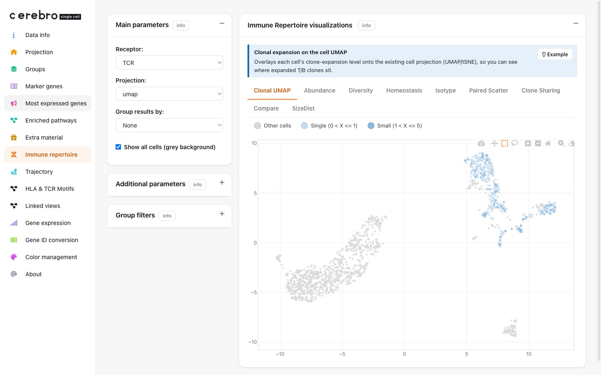

> **Demo data & source.** Shown on **`PBMC - Full (T+B)`** (`demo_full_tcr_bcr.crb`),
> built from the 10x Genomics public dataset *vdj_v1_hs_pbmc3* (Chromium 5' V(D)J).
> Source, acquire commands and full build code:
> [Full pipeline: PBMC - Full (T+B)](demo_dataset_pbmc_tcr_bcr.html).

# Overview

CerebroNexus v1.4 introduces a comprehensive **Immune Repertoire** module for
interactive exploration of T-cell and B-cell receptor clonotype data. The module
leverages the `scRepertoire` package and ships **7 visualization tabs** by
default (9 once ≥ 2 samples are present), covering clonal abundance, diversity,
homeostasis, BCR isotype, paired comparisons, and clone sharing. A larger set
of additional analyses (sequence length/AA%/entropy/property/k-mer, gene
usage, overlap, rarefaction, ...) exists in the module's source but is kept
disabled by default to keep the tab strip focused — see
`inst/shiny/v1.4/immune_repertoire/visualizations.R` if you want to re-enable
any of them in a fork.

The Immune Repertoire tab appears **conditionally** in the sidebar — only when
the loaded `.crb` file contains TCR or BCR clonotype annotations. The bundled
`example.crb` ships with real 10x immune-repertoire data (the
`sc5p_v2_hs_PBMC_10k` dataset, with 5' gene expression, TCR, and BCR from the
same experiment), so the tab — including TCR, BCR (isotype/SHM), and
cross-sample comparisons — is available out of the box. (This single 10x donor
is randomly split into three demo samples so cross-sample features have data;
the sample labels are not distinct biological donors.)

Grouping and sample-splitting in the module work for **any** grouping variable
present in the data set's cell metadata (sample, condition, cell type, etc.).
The clonotype tables themselves only need the standard scRepertoire columns;
the module joins metadata onto them by barcode at runtime.

# Preparing immune repertoire data

## Background: scRepertoire

The immune repertoire module is built on the
[scRepertoire](https://www.borch.dev/uploads/screpertoire/) package (≥ 2.0),
which is the standard tool for turning 10x Cell Ranger V(D)J output into
per-cell clonotype annotations. CerebroNexus depends on it as a mandatory
`Imports`, so a standard install already provides it (via Bioconductor):

```{r, eval = FALSE}
# Bioconductor
BiocManager::install("scRepertoire")
```

Because loading `scRepertoire`'s namespace pulls in a large dependency tree
(~90 packages and several seconds of `lazyLoadDBfetch`), CerebroNexus does
**not** load it at app startup. Availability is probed cheaply with
`system.file()`, and the namespace is loaded lazily on the first
*scRepertoire-backed* plot — self-made plots (Clone Sharing, Definition) and the
default Clonal UMAP do not need it and never trigger the load. That first
scRepertoire plot therefore pays a one-time load of several seconds; because a
namespace is process-wide, every plot afterwards is warm for every session
sharing that R worker (and that first load briefly blocks those other sessions).
There is no background prewarm — it cannot be made non-blocking on Shiny's single
R thread. Repertoire figures are still computed by `scRepertoire`; only the
timing of the load changed.

The full scRepertoire workflow is documented in its vignettes —
[Loading data](https://www.borch.dev/uploads/screpertoire/articles/loading) and
[Combining contigs](https://www.borch.dev/uploads/screpertoire/articles/combining_contigs).
The steps below summarise just what CerebroNexus needs.

## Step 1 — load the V(D)J contigs

Read the `filtered_contig_annotations.csv` produced by Cell Ranger for each
sample. TCR and BCR are separate libraries, so load each one:

```{r, eval = FALSE}
library(scRepertoire)

# one filtered_contig_annotations.csv per sample
tcr_contigs <- lapply(tcr_paths, read.csv) # T-cell receptor contigs
bcr_contigs <- lapply(bcr_paths, read.csv) # B-cell receptor contigs
```

## Step 2 — combine contigs into clonotypes

`combineTCR()` and `combineBCR()` collapse contigs into per-cell clonotypes and
add the standard `CTgene` / `CTnt` / `CTaa` / `CTstrict` columns. Use the
matching function for each receptor type:

```{r, eval = FALSE}
combined_tcr <- combineTCR(tcr_contigs, samples = sample_names)
combined_bcr <- combineBCR(bcr_contigs, samples = sample_names)
```

## Step 3 — attach to the Seurat object and export

Build a named list of data.frames (one element per sample) holding the
scRepertoire clonotype columns, attach it to the Seurat object's
`@misc$immune_repertoire` slot, and export. `exportFromSeurat()` picks the slot
up automatically. To include both receptor types, row-bind the T- and B-cell
clonotypes per sample (cells are mutually exclusive — a cell has a TCR *or* a
BCR):

```{r, eval = FALSE}
library(CerebroNexus)

ir_cols <- c("barcode", "CTgene", "CTnt", "CTaa", "CTstrict")
to_df <- function(x) x[, ir_cols, drop = FALSE]

ir_data <- lapply(sample_names, function(s) {
  rbind(to_df(combined_tcr[[s]]), to_df(combined_bcr[[s]]))
})
names(ir_data) <- sample_names

seurat_object@misc$immune_repertoire <- ir_data

exportFromSeurat(
  seurat_object,
  file = "my_data.crb",
  experiment_name = "my_experiment",
  organism = "hg",
  groups = c("sample", "seurat_clusters")
)
```

Each data.frame must contain the scRepertoire clonotype columns `barcode`,
`CTgene`, `CTnt`, `CTaa`, and `CTstrict`. The `barcode` values should match
the cell barcodes in the Seurat object's metadata. Chains (e.g. TRA/TRB,
IGH/IGK/IGL) are detected automatically from `CTgene`, and grouping variables
(sample, condition, cell type, ...) are read from the cell metadata at runtime —
the clonotype tables themselves only need the five columns above.

# Module interface

## Settings panel

The settings panel provides three controls:

- **Clone call**: which clonotype identifier to use for analysis
  (`gene`, `nt`, `aa`, or `strict`)
- **Group results by:** a metadata grouping variable for faceted comparisons
  (relabelled **Compare by:** on the Paired Scatter/Compare tabs, where it
  instead picks the two comparison units)
- **Chain**: filter to TCR chains (TRA, TRB, TRG, TRD), BCR chains
  (IGH, IGK, IGL), or all (`both`)

When multiple samples are present, additional controls appear for scatter
plot sample selection and multi-sample comparison.

## Visualization tabs

The module provides **7 tabs by default**, plus **2 more once ≥ 2 samples**
are present (9 total). Each includes a contextual help panel explaining the
biological interpretation with example guidance.

### Default tabs (always shown)

- **Clonal UMAP**: overlays clone-expansion level
  (Single/Small/Medium/Large/Hyperexpanded) on the cell projection, reusing the
  dataset's UMAP/tSNE coordinates; a Receptor (TCR/BCR) and Projection selector
  drive it. The default landing tab.
- **Abundance**: ranks clonotypes by cell count; steep drop-off indicates
  oligoclonal dominance
- **Diversity**: Shannon entropy with bootstrap confidence intervals
- **Homeostasis**: categorizes clonotypes into size classes from Rare to
  Hyperexpanded
- **Isotype**: stacked-bar of IgM/IgD/IgG1-4/IgA1-2/IgE proportions per
  sample or timepoint — a class-switch readout unique to BCR data
- **Paired Scatter**: compares clonotype frequencies between two comparison
  units (samples, conditions, cell types, ...); dots off the diagonal are
  clones expanded or contracted between the two
- **Clone Sharing**: classifies each clonotype as Private (in a single unit),
  Public within-group, or Public cross-group, using a configurable sharing unit
  (default `sample`); with no group selected it degrades to Private / Shared

### Cross-sample tabs (shown when ≥ 2 samples are present)

- **Compare**: alluvial diagram tracking the top clonotypes across samples —
  ribbons that flow across samples are shared ("public") clones
- **SizeDist**: hierarchical (Ward) clustering of samples by their clone-size
  distribution "shape"

### Additional analyses (present in source, disabled by default)

Sequence properties (Length, AA%, Entropy, Property, K-mer), gene usage
(Gene usage/vizGenes/percentGenes/percentVJ), Scatter, Overlap, the clone-
Definition waterfall, Quant, and Rarefaction are all implemented and kept
commented out in `visualizations.R` to keep the default tab strip focused —
uncomment the relevant `tabPanel(...)` call to re-enable one.
