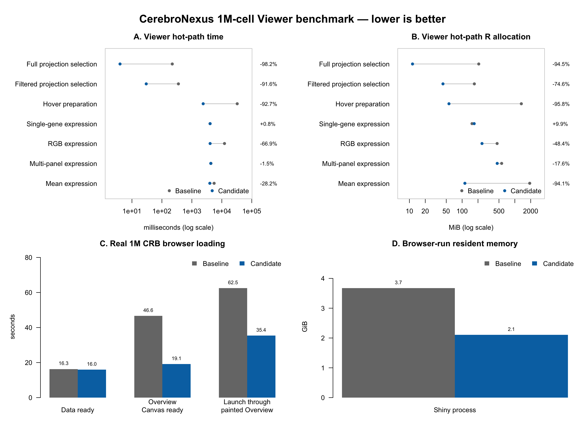

```{r, include = FALSE}
knitr::opts_chunk$set(collapse = TRUE, comment = "#>", eval = FALSE)
```

# Scope

This benchmark compares two Git revisions using the official 10x Genomics E18
mouse-brain matrix. It retains exactly 1,000,000 cells, creates a BPCells-backed
Seurat object and Cerebro file, then measures:

- filtering, sampling, hover preparation and expression access in R;
- real Viewer loading, Overview Canvas painting and Shiny process memory;
- equality or operation-specific invariants before recording every result.

The executable source of truth is
`tests/bench/run_viewer_1m_benchmark.sh`; this vignette documents its inputs,
outputs and interpretation without duplicating its implementation.

# Data and requirements

The `"1m"` preset downloads the 10x 1.3M E18 mouse-brain filtered H5 and keeps
1,000,000 evenly distributed barcodes. The reported artifact has 27,998 genes,
33 clusters and a full 1,000,000-row UMAP. Preparation uses Seurat's sketch
workflow and stores expression with BPCells.

The measured run used Apple M1 Pro hardware with 32 GiB RAM, macOS 27.0,
R 4.6.1 (`aarch64`), BPCells 0.3.1, Seurat 5.5.1, Shiny 1.14.0 and
shinytest2 0.5.1. Reproduction requires Chrome or Chromium and at least 15 GB
of free disk space. The first preparation took 1,342.12 seconds and reached
8.47 GiB maximum resident memory.

Check the required packages without installing anything:

```{bash}
Rscript - <<'RS'
required <- c(
  "BPCells", "devtools", "dplyr", "glue", "magrittr", "Matrix",
  "ps", "Seurat", "SeuratObject", "shiny", "shinytest2"
)
missing <- required[
  !vapply(required, requireNamespace, quietly = TRUE, FUN.VALUE = logical(1))
]
if (length(missing)) stop("Missing packages: ", paste(missing, collapse = ", "))
RS
```

# Run the benchmark

From the repository root:

```{bash}
tests/bench/run_viewer_1m_benchmark.sh
```

The default run compares revision `892097a1` with
`perf/pr1-backend-hot-paths`, uses three repetitions, draws 10% of the loaded
cells and writes results below the ignored `tests/bench/scratch/` directory.
It downloads and prepares the example only when the reusable cache is
incomplete.

Override the baseline, candidate, output directory or cache when needed:

```{bash}
CEREBRO_LARGE_CACHE="/scratch/cerebro-large-cache" \
REPEATS=3 \
PERCENT=10 \
tests/bench/run_viewer_1m_benchmark.sh \
  892097a1 \
  perf/pr1-backend-hot-paths \
  /absolute/path/viewer-1m-results
```

`PERCENT` must be between 10 and 100. The runner validates both revisions,
creates detached temporary worktrees, reuses one CRB, alternates browser order,
draws the figure and removes the temporary worktrees.

# Outputs and focused reruns

The output directory contains:

| File | Contents |
|---|---|
| `run_manifest.tsv` | exact revisions, CRB, repetitions and display percentage |
| `hot_paths.tsv` | before/after R time, allocation and correctness per operation |
| `browser.txt` | every browser run and the before/after medians |
| `viewer_1m_benchmark_summary.csv` | normalized hot-path and browser metrics |
| `viewer_1m_benchmark.png` | four-panel comparison figure |

Rerun an individual stage against an existing CRB:

```{bash}
Rscript tests/bench/viewer_1m_hot_paths.R BEFORE_ROOT AFTER_ROOT CRB 3
Rscript tests/bench/viewer_1m_browser.R BEFORE_ROOT AFTER_ROOT CRB 3 10
Rscript tests/bench/viewer_1m_plot.R HOT_PATH_TSV BROWSER_OUTPUT OUTPUT_DIR
```

The repository retains the measured inputs and normalized CSV under
`tests/bench/viewer_1m_results/`. Regenerate the reference figure without the
large matrix:

```{bash}
Rscript tests/bench/viewer_1m_plot.R \
  tests/bench/viewer_1m_results/hot_paths.tsv \
  tests/bench/viewer_1m_results/browser_summary.txt \
  /tmp/cerebronexus-viewer-1m-figure
```



Complete measured values, preparation sizes and revision identifiers are in
`tests/bench/VIEWER_1M_RESULTS.md`.

# Use the large examples

Choose one preset:

```{r}
launchCerebro(
  large_example = "1m",
  percentage_cells_to_show = 10
)
```

Or package both examples into one Viewer. Their input order is preserved in
the existing dataset selector:

```{r}
createShinyApp(
  cerebro_data = NULL,
  result_dir = "large-examples-app",
  large_example = c("50k", "1m"),
  large_example_cache_dir = "/scratch/cerebro-large-cache",
  launch_browser = FALSE
)
```

`large_example_cache_dir = NULL` uses the platform-specific R user cache.
Specify it only to place the reusable source, Seurat, BPCells and CRB artifacts
on a larger or shared filesystem. The 50K preset downloads about 119 MB and
uses roughly 1 GB after preparation; the 1M preset downloads about 4.2 GB and
uses roughly 11 GB.

# Interpretation

Compare medians, not the fastest run. Keep the CRB, display percentage,
viewport, software versions, power mode and repetition count fixed. A first
read may populate operating-system caches; alternating browser order reduces
but does not eliminate cache and thermal bias.

`Rprofmem()` reports allocations visible to R, not all native memory held by
BPCells or the operating system. The browser benchmark therefore records Shiny
process RSS separately. The reported single-gene timing is neutral; the main
expression gains come from batching RGB reads and keeping aggregate means
backend-native.

For the candidate's full-Canvas acceptance check, run the candidate as both
inputs with `PERCENT=100`. The recorded two runs painted all 1M points in 72.4
and 73.5 seconds using 4,616.7 and 4,368.5 MiB RSS.
