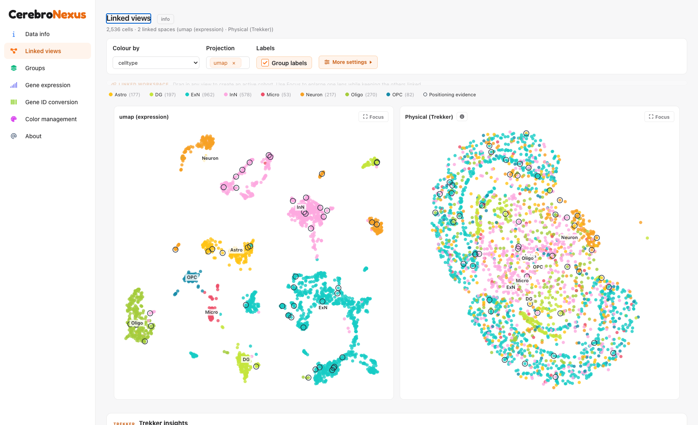
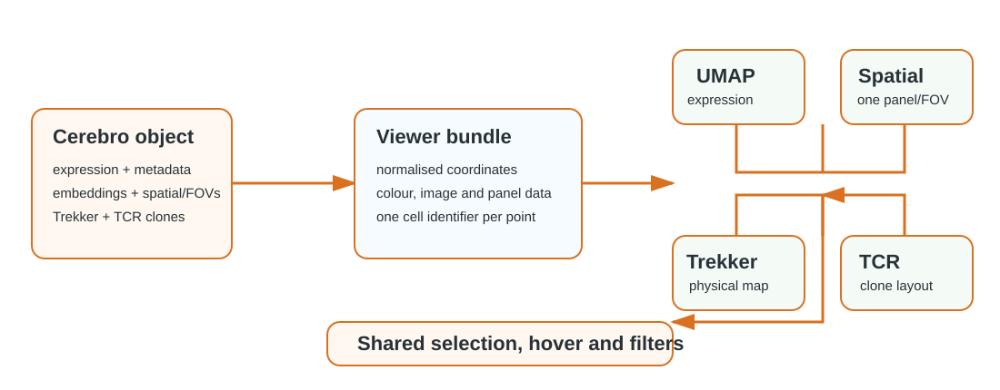

```{r, include = FALSE}
knitr::opts_chunk$set(collapse = TRUE, comment = "#>", eval = FALSE)
```

# What Linked Views is

**Linked Views** replaces the separate Overview, Spatial and Trekker plotting
pages with one workspace. Every panel represents the same cells, so a colour
choice, group filter, hover or selection is interpreted consistently across an
embedding, one or more spatial sections, Trekker's physical map and the TCR
clone layout. It appears when the loaded `.crb` contains at least one supported
coordinate space.

The workspace is deliberately not a merged coordinate system: each spatial
section/FOV remains its own panel. That makes it possible to compare different
tissues without pretending that their pixel or micron coordinates share an
origin.



# Run the shipped demo

The following commands work from a source checkout and start the application
with its shipped, derived examples. No fixture-generation step is needed.

```sh
# From the repository root
R --vanilla
```

```{r}
# In the R session, from the repository root.
devtools::load_all(".", quiet = TRUE)
shiny::runApp("inst", launch.browser = TRUE)
```

In the **Select dataset** control choose **Mouse brain (Trekker)**, then open
**Linked views**. The initial workspace contains an expression embedding and
Trekker physical coordinates, as shown above. Other shipped examples add the
spatial or clone panels for the modalities they contain.

For a deployed, fixed-data app, build a self-contained bundle instead. Paths
are named because the names become dataset labels in the app:

```{r}
trekker <- "inst/extdata/examples/demo_trekker.crb"
createShinyApp(
  cerebro_data = c("Mouse brain (Trekker)" = trekker),
  result_dir = "linked-views-app",
  launch_browser = FALSE
)
shiny::runApp("linked-views-app")
```

# Read the workspace

The control bar has four principal jobs:

| Control | What it changes | Important detail |
|---|---|---|
| **Colour by** | the metadata/gene value drawn in every applicable panel | a colour change is shared, not copied panel-by-panel |
| **Projection** | the selected expression embeddings | select several to create several linked panels |
| **Spatial data** | the selected spatial sections/FOVs | each selection receives an independent panel and image selector |
| **More settings** | point appearance, images and advanced display settings | use **Reset** to return an image to its configured alignment |

Drag in a panel to create the active cohort; use **Focus** to enlarge one lens
without breaking the shared state. The panels remain linked by cell identifier,
not by screen position. This is why a lasso in UMAP can highlight the same
cells in a spatial section or Trekker map.



# Prepare multiple spatial sections and images

Spatial coordinates live in the `.crb`; images are attached when an app is
bundled. `spatial_images` uses the explicit **dataset → spatial section/FOV →
image label → file** hierarchy. It prevents a background from silently being
applied to the wrong section.

```{r}
createShinyApp(
  cerebro_data = c("My experiment" = "results/my_experiment.crb"),
  result_dir = "my-linked-app",
  spatial_images = list(
    "My experiment" = list(
      "section-A" = c("H&E" = "images/section-A-he.png"),
      "section-B" = c(
        "DAPI" = "images/section-B-dapi.png",
        "PAS" = "images/section-B-pas.png"
      )
    )
  ),
  spatial_image_settings = list(
    "My experiment" = list(
      "section-A" = list("H&E" = list(flip_y = TRUE, scale_x = 1.2)),
      "section-B" = list("DAPI" = list(offset_y = -25, image_opacity = 0.7))
    )
  ),
  launch_browser = FALSE
)
```

The labels (`section-A`, `H&E`, `DAPI`) must exactly match the spatial entry
and image names in the configuration. The app copies configured image files to
its private bundle and reads them server-side; they are not exposed as a public
HTTP directory.

# Verify a build before sharing it

```sh
# Browser and data-contract coverage for this feature
R --vanilla -q -e 'devtools::test(filter = "^(coordinated-views|coordinated-views-browser|spatial)$")'

# Render all vignettes, including this guide
R --vanilla -q -e 'devtools::build_vignettes()'

# Same package check shape used by CI (tests run in their own job)
Rscript -e "devtools::check(args = c('--timings', '--no-tests'), vignettes = TRUE, error_on = 'warning')"
```

# Troubleshooting

**No Linked Views tab.** Confirm that the `.crb` includes a supported embedding,
spatial entry, Trekker data or clone information. The tab is conditional; it is
not shown for a dataset with no coordinate space.

**A spatial section has no image choice.** The coordinates are still valid.
Check the dataset, section and image-label nesting in `spatial_images`, then
rebuild the app. A missing optional image is omitted rather than served from an
arbitrary filesystem path.

**Panels are blank or poorly sized after restoring a browser tab.** Resize the
browser once or switch away and back to Linked Views; the workspace observes its
panel host and reflows canvases after restore. Use **Focus** when comparing a
single dense panel at full size.

**Selection does not appear where expected.** Check that the modalities share
the same cell identifiers in the exported object. Linked Views joins spaces by
those identifiers; it does not infer correspondence from nearby coordinates.
