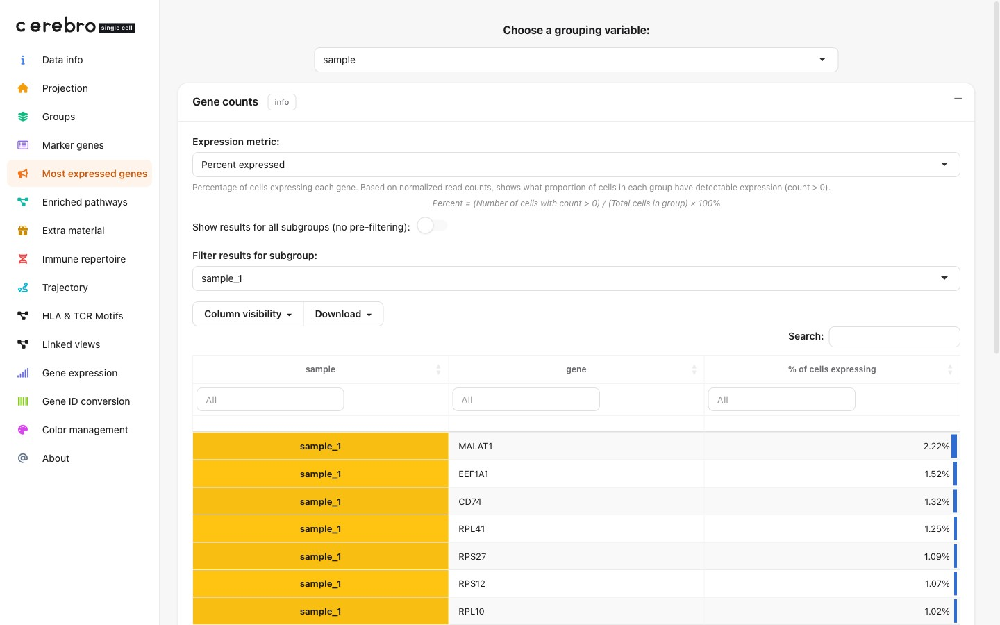

```{r, include = FALSE}
knitr::opts_chunk$set(collapse = TRUE, comment = "#>")
```



> **Demo data & source.** Shown on the demo PBMC data set (`demo_full_tcr_bcr.crb`).
> Every dataset in the app is a real public dataset &mdash; sources, acquire
> commands and full build code are in
> [Demo datasets: sources &amp; processing](demo_datasets.html).

# Overview

The **Most expressed genes** tab shows, for every group in the dataset, the
genes with the highest mean expression. Unlike marker genes (which identify
genes that differ _between_ groups), most expressed genes simply rank genes
by their average expression _within_ each group.

Like Marker genes and Enriched pathways, this tab is inserted into the sidebar
conditionally — it only appears once the loaded `.crb` actually has most-
expressed-gene tables for at least one grouping variable.

# Quick start

```{r, eval = FALSE}
library(CerebroNexus)
launchCerebroV1.4()
```

1. Launch CerebroNexus and load a `.crb` file
2. Click **Most expressed genes** in the sidebar
3. Select a grouping variable (e.g., `seurat_clusters`, `sample`)
4. The table shows, for each group, the gene name, mean expression, and
   percentage of cells expressing that gene

# Table features

The results table is rendered as an interactive DT table:

- **Search**: filter genes by name across all groups
- **Sort**: click column headers to sort by expression, percentage, or group
- **Download**: use the export buttons to save results as CSV or Excel

# Data export

Most-expressed-gene tables are computed with `getMostExpressedGenes()`, which
writes into `object@misc$most_expressed_genes` on the Seurat object in-place —
`exportFromSeurat()` then just picks up whatever is already there.

```{r, eval = FALSE}
seurat_object <- getMostExpressedGenes(
  seurat_object,
  groups = c("sample", "seurat_clusters")
)
exportFromSeurat(
  seurat_object,
  file = "my_data.crb",
  experiment_name = "my_experiment",
  organism = "hg",
  groups = c("sample", "seurat_clusters")
)
```

# See also

`vignette("cerebroApp_workflow_Seurat")` for the complete export workflow.
