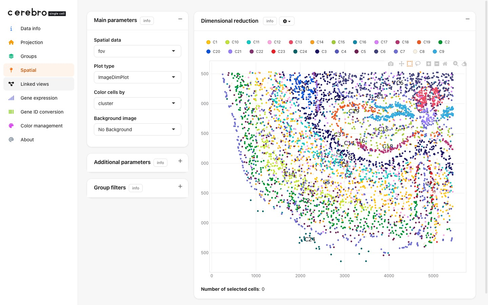
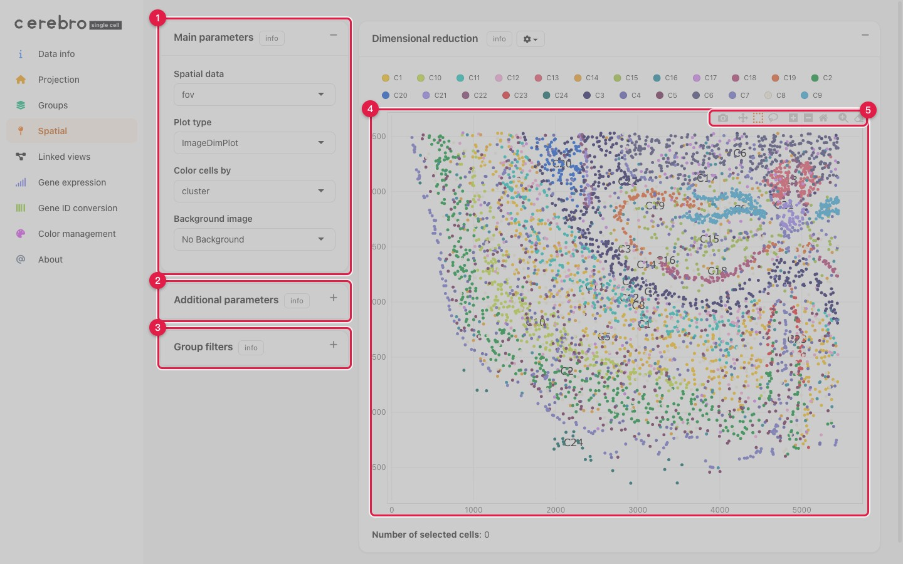

```{r, include = FALSE}
knitr::opts_chunk$set(collapse = TRUE, comment = "#>")
```



> **Demo data & source.** The screenshot above uses **`Mouse brain (Xenium)`**,
> one of four real public spatial demos in the app. Each is downloaded,
> down-sampled and packaged as a `.crb` — with the exact acquire commands and
> the full build script — on its own page:
> [10x Visium](demo_dataset_visium.html) ·
> [Slide-seq v2](demo_dataset_slideseq.html) ·
> [MERFISH](demo_dataset_merfish.html) ·
> [10x Xenium](demo_dataset_xenium.html).

# Overview

The **Spatial** tab provides interactive visualization of spatial
transcriptomics data (e.g., Xenium, Visium). It appears _conditionally_ — only
when the loaded `.crb` file contains spatial coordinates. Cells are plotted at
their spatial positions, optionally overlaid on a histological background image,
with interactive controls for color mapping, point aesthetics, group filtering,
and selection-based analysis.

# Quick start

The Spatial tab surfaces automatically once a dataset carrying spatial data is
loaded. To also show a histological image behind the cells, pass its path
through `createShinyApp()`:

```{r, eval = FALSE}
library(CerebroNexus)

createShinyApp(
  cerebro_data = c("My spatial sample" = "path/to/sample_spatial.crb"),
  result_dir = "cerebro_app",
  spatial_images = c("My spatial sample" = "path/to/sample_histology.png"),
  spatial_images_flip_y = c("My spatial sample" = TRUE),
  spatial_images_scale_x = c("My spatial sample" = 0.9)
)
```

The names of `spatial_images` (and every alignment parameter) must match the
names of `cerebro_data`. When the app runs:

1. If the dataset contains spatial data, **Spatial** appears in the sidebar.
2. The **Background image** dropdown lets you toggle the histology overlay.
3. The **Image opacity** slider blends the image against the cells.
4. Lasso or box-select cells to drive the selected-cells plot and table.

# Visualization panels



The Spatial tab is laid out like the other projection tabs:

1. **Main parameters** — choose the spatial layer, **plot type**, the variable to
   **colour cells by**, and the **background image** (histology overlay).
2. **Additional parameters** — point size, opacity, percentage of cells to show,
   and group labels (click to expand).
3. **Group filters** — show or hide individual groups (e.g. specific clusters).
4. **Projection** — the cells drawn at their physical coordinates, optionally over
   the tissue image.
5. **Selection toolbar** — box- or lasso-select cells (this drives the *Selected
   cells* plot and table below), plus zoom, pan and PNG download.

## Projection

The main spatial view shows cells positioned at their coordinates, optionally on
a histological background. Cells are coloured by a user-selected metadata
variable. Hover to see cell metadata; zoom and pan via plotly.

## Main parameters

- **Spatial data**: which image/FOV to plot when several are present.
- **Plot type**: `ImageDimPlot` (categorical), `ImageFeaturePlot` (single
  gene), or `Co-expression (RGB)` (three genes, one per red/green/blue
  channel, blended per cell).
- **Color cells by**: metadata variable used for cell coloring
  (`ImageDimPlot` only).
- **Feature/Gene** / **Red · Green · Blue channel gene**: gene picker(s) for
  the other two plot types.
- **Background image**: histology overlay (only shown when a matching
  `spatial_images` entry exists for the loaded dataset).

## Additional parameters

- **Point size / opacity**: control visual density.
- **Show % of cells**: randomly downsample for performance.
- **Draw border around cells**: toggle cell outlines.
- **Plot group labels in exported PDF**: adds group-centroid labels to the
  PDF export only, not the live plot; a second checkbox, **Outline group
  regions (convex hull)**, draws a hull per group.
- **Background image block** (shown once a background is selected): **Image
  opacity**, **Move horizontally/vertically** (slider + numeric box), **Lock
  aspect ratio** / **Scale (about centre)** or independent **Scale X/Y**,
  **Rotate (about centre)**, **Flip horizontally/vertically**, **Reset
  image**, and **Copy alignment as preset** (emits `Cerebro.options` code to
  ship the hand-tuned alignment as the dataset's default).

## Group filters

Select which metadata groups to display. Cells passing all active filters are
shown in the projection.

## Selected cells

Lasso or box-select cells in the projection to view:

- **Plot of selected cells**: bar plot of group composition (categorical) or
  violin/box plot (continuous).
- **Table of selected cells**: interactive DT table with metadata, exportable to
  CSV or Excel.

# Data preparation

Spatial data must be embedded in the `.crb` file by the export pipeline.
`exportFromSeurat()` **automatically detects** spatial data on the Seurat object
(`object@images`, covering Visium / Xenium / FOV) and stores the coordinates and
expression — no special flag is required.

```{r, eval = FALSE}
library(CerebroNexus)

seurat_obj <- qs::qread("path/to/seurat_object.qs")

exportFromSeurat(
  object = seurat_obj,
  assay = "SCT",
  slot = "data",
  organism = "hg",
  experiment_name = "My Spatial Dataset",
  groups = c("sample_id", "condition", "cell_type"),
  file = "my_spatial_data.crb"
)
```

If the Seurat object carries images, the resulting `.crb` gains a spatial
projection and the Spatial tab becomes available when it is loaded.

## Placing histological images

Histology images are **not** stored inside the `.crb`; they are passed to
`createShinyApp()`, which copies them into the generated app bundle and
references them by dataset name. Both JPG and PNG are supported.

```{r, eval = FALSE}
createShinyApp(
  cerebro_data = c("My spatial sample" = "my_spatial_data.crb"),
  result_dir = "cerebro_app",
  spatial_images = c("My spatial sample" = "path/to/histology.png")
)
```

## Multiple samples with alignment

When several capture areas live in one app, give each its own image and use the
flip / scale / rotation parameters to align each image with its coordinate
system. Every named entry must use the same names as `cerebro_data`:

```{r, eval = FALSE}
createShinyApp(
  cerebro_data = c(
    "Ctrl sample" = "ctrl_spatial.crb",
    "MS sample" = "ms_spatial.crb"
  ),
  result_dir = "cerebro_app",
  spatial_images = c(
    "Ctrl sample" = "ctrl_histology.png",
    "MS sample" = "ms_histology.png"
  ),
  spatial_images_flip_y = c("Ctrl sample" = TRUE, "MS sample" = TRUE),
  spatial_images_scale_x = c("Ctrl sample" = 0.90, "MS sample" = 0.95),
  spatial_images_scale_y = c("Ctrl sample" = 1.00, "MS sample" = 1.45),
  spatial_plot_rotation = c("Ctrl sample" = -61, "MS sample" = 205)
)
```

# Spatial parameters reference

| Parameter | Type | Default | Description |
|-----------|------|---------|-------------|
| `spatial_images` | named vector/list | `NULL` | Maps each dataset name to a histology image path (JPG or PNG). Names must match `cerebro_data`. |
| `spatial_images_flip_x` | named vector/list | `NULL` | Flip the image horizontally. `TRUE` mirrors across the vertical axis. |
| `spatial_images_flip_y` | named vector/list | `NULL` | Flip the image vertically. `TRUE` mirrors across the horizontal axis. |
| `spatial_images_scale_x` | named vector/list | `NULL` | Multiplicative X-axis scale (1.0 = no scaling). |
| `spatial_images_scale_y` | named vector/list | `NULL` | Multiplicative Y-axis scale (1.0 = no scaling). |
| `spatial_images_offset_x` | named vector/list | `NULL` | Horizontal image offset, in data (coordinate-space) units. |
| `spatial_images_offset_y` | named vector/list | `NULL` | Vertical image offset, in data (coordinate-space) units. |
| `spatial_plot_rotation` | named vector/list | `NULL` | Rotation of cell coordinates in degrees (e.g. -90 to 270), for when capture-area and image orientation differ. |

Every one of these ships as the *initial* alignment; a user can still nudge it
live via the Additional-parameters controls above, and use **Copy alignment
as preset** to turn a hand-tuned adjustment back into this same parameter
set.

Entries with no matching dataset name are ignored with a warning rather than
raising an error, so a typo never blocks app generation. Missing entries default
to a no-op (no flip, scale 1.0, no rotation).

# See also

- `vignette("cerebroApp_workflow_Seurat")` for the complete export workflow.
- `vignette("create_a_self_contained_shiny_app")` for app bundling options.
- `vignette("multi_crb")` for hosting several datasets in one app.
