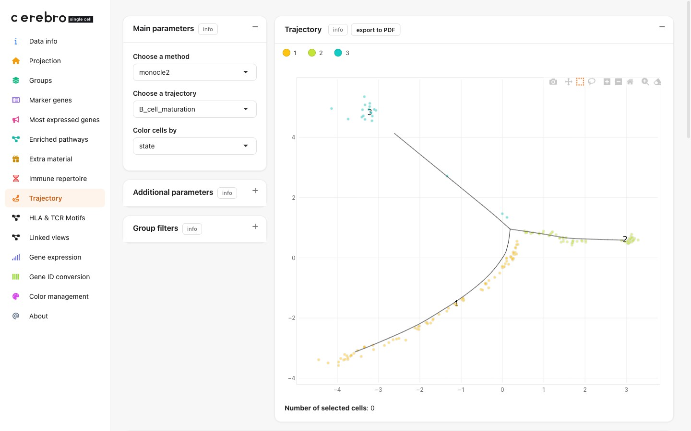

```{r, include = FALSE}
knitr::opts_chunk$set(collapse = TRUE, comment = "#>")
```



> **Demo data & source.** Shown on the B-cell subset of **`PBMC - Full (T+B)`**;
> the monocle2 pseudotime trajectory is computed and stored as documented in
> [Full pipeline: Trajectory](demo_dataset_trajectory.html). It is
> *illustrative* of the feature &mdash; peripheral-blood B cells, not a
> developmental lineage.

# Overview

The **Trajectory** tab provides interactive exploration of pseudotime
trajectories (e.g., from Monocle 2). It appears _conditionally_ — only
when the loaded `.crb` file contains trajectory data.

This module restores functionality from the original cerebroApp v1.3.
The code is the original implementation by Roman Hillje, restructured
into the v1.4 sub-file layout with no functional changes.

# Quick start

```{r, eval = FALSE}
library(CerebroNexus)
launchCerebroV1.4()
```

1. Launch CerebroNexus and load a `.crb` file with trajectory data
2. If trajectory data is present, **Trajectory** appears in the sidebar
3. Select a trajectory method and name from the dropdowns
4. Explore cells along pseudotime, expression metrics, and state
   distributions

# Visualization panels

## Projection

Shows cells positioned along the trajectory in a 2D projection. Cells are
coloured by pseudotime state. Hover to see cell metadata.

## Distribution along pseudotime

Density or scatter plots showing how cells are distributed along pseudotime.
Optionally colour by metadata group to compare distributions.

## Expression metrics

Gene expression plotted against pseudotime. Select a gene to see how its
expression changes along the trajectory. A smooth trend line helps identify
gradual expression changes characteristic of developmental processes.

## States by group

Stacked bar chart showing the proportion of cells from each metadata group
within each pseudotime state. Useful for identifying which groups are
enriched in specific trajectory branches.

## Statistics

- **Number of expressed genes by state**: boxplot of detected gene counts
  per cell, faceted by state
- **Number of transcripts by state**: boxplot of UMI counts per cell,
  faceted by state
- **Selected cells table**: interactive DT table of cells in the current
  selection or state

# Data preparation

Trajectories must be computed with Monocle 2 (or compatible) and exported
via `extractMonocleTrajectory()` before embedding in the `.crb` file.

```{r, eval = FALSE}
library(CerebroNexus)
## extractMonocleTrajectory() returns the SEURAT object with the trajectory
## embedded in @misc$trajectories$monocle2 -- exportFromSeurat() then picks it
## up automatically; there is no separate `trajectories=` argument.
seurat_object <- extractMonocleTrajectory(
  monocle = monocle_object,
  seurat = seurat_object,
  trajectory_name = "trajectory_1"
)
exportFromSeurat(
  seurat_object,
  file = "my_data.crb",
  experiment_name = "my_experiment",
  organism = "hg",
  groups = c("sample", "cell_type")
)
```

# See also

- `vignette("cerebroApp_workflow_Seurat")` for the complete export workflow
